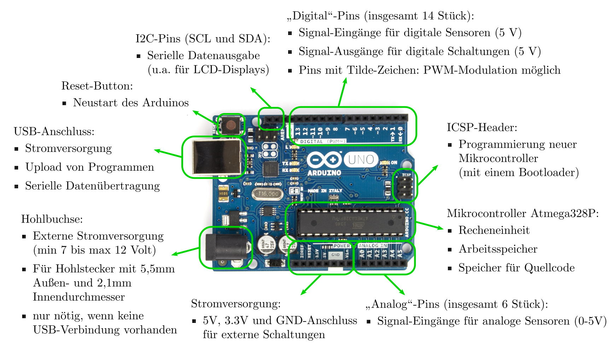

.. index:: Arduino; Pin-Belegung, Pulsweiten-Modulation (PWM)

.. _Aufbau eines Arduino UNO:

Aufbau eines Arduino UNO
========================

In der folgenden Abbildung sind die wichtigsten Komponenten eines Arduino UNO
mit kurzen Beschreibungen aufgelistet.

    Das Entwicklerboard Arduino UNO im Detail.

    .. only:: html

        :download:`SVG: Arduino UNO mit Beschreibung
        <../pics/arduino/arduino-uno-mit-beschreibung.svg>`

Über die Pin-Leisten auf beiden Seiten des Arduinos kann dieser mittels
Jumper-Kabeln mit externen Elektronik-Komponenten beziehungsweise einer
Steckplatine verbunden werden:

* Die analogen Pins ``A0`` bis ``A5`` sind als Sensor-Eingänge zum Messen von
  Spannungswerten zwischen :math:`\unit[0]{V}` und :math:`\unit[5]{V}` geeignet;
  durch einen eingebauten Analog-Digital-Wandler werden die gemessenen
  Spannungswerte auf einem Zahlenbereich von ``0`` (keine Spannung) bis ``1023``
  (maximale Spannung, also :math:`\unit[5]{V}`) abgebildet.

* Die digitalen Pins ``0`` bis ``13`` können ebenfalls als Sensor-Eingänge
  festgelegt werden: Eine anliegende Spannung von :math:`\unit[>2,5]{V}` wird
  als ``HIGH`` (Zahlenwert ``1``), eine niedrigere Spannung als ``LOW``
  (Zahlenwert ``0``) interpretiert.

* Die digitalen Pins ``0`` bis ``13`` können zudem als digitale
  Spannungs-Ausgänge festgelegt werden: Sie geben im Modus ``HIGH`` eine
  Spannung von etwa :math:`\unit[5]{V}`, im Modus ``LOW`` eine Spannung von
  :math:`\unit[0]{V}` aus. Die Stromstärke ist dabei allerdings auf
  :math:`\unit[40]{mA}` begrenzt; gegebenenfalls wird die Spannung der Pins
  automatisch herab geregelt, um diese Begrenzung zu erreichen.

  Eine Besonderheit stellt der Digital-Pin ``13`` dar: Dort ist der
  Ausgabe-Strom auf nur :math:`\unit[20]{mA}` begrenzt, so dass dort eine LED
  direkt (ohne Vorwiderstand) angeschlossen werden kann (direkt neben Pin ``13``
  ist ein ``GND``-Pin, so dass dafür nicht einmal eine Steckplatine nötig ist).
  Bei neueren Versionen des Arduino UNO ist zwischen Pin ``13`` und ``GND``
  sogar eine SMD-LED fest eingebaut.

* Die mit dem Tilde-Zeichen ``~`` versehenen Pins (``3``, ``5``, ``6``, ``9``,
  ``10``, ``11``) können, wenn sie als Ausgabe-Pins festgelegt werden, zudem
  mittels einer so genannter Pulsweiten-Modulation (PWM) sehr schnell zwischen
  :math:`\unit[0]{V}` und :math:`\unit[5]{V}` hin und her wechseln. Man kann
  dabei Werte zwischen ``0`` und ``255`` angeben, wobei ``0`` für "immer aus"
  und ``255`` für "immer an" steht. [#]_

Die übrigen Anschlüsse des Boards (AREF- und ICSP-Header) sind für eine normale
Benutzung nicht von Bedeutung.

.. raw:: html

    

.. only:: html

    .. rubric:: Anmerkungen:

.. [#] Beispielsweise kann man mittels PWM einen Motor oder eine Glühbirne bei
    einem Wert von ``128`` mit nur "halber Leistung" ansteuern, da er nur die
    Hälfte der Zeit mit Spannung versorgt wird und sich die andere Hälfte der
    Zeit im Leerlauf befindet.

    Eine LED lässt sich so ebenfalls "dimmen": Die LED ist zwar schnell genug,
    um in der gleichen Frequenz mitzublinken, unser Auge jedoch nicht. Da wir
    nur 25 Einzelbilder je Sekunde wahrnehmen können, erscheint uns eine LED,
    die nur die Hälfte der Zeit an ist, gegenüber einer permanent hellen LED als
    dunkler.

