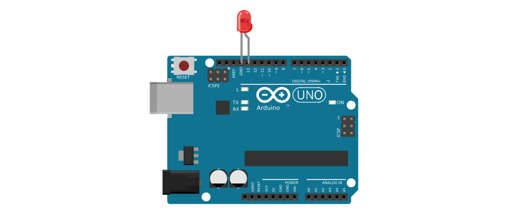
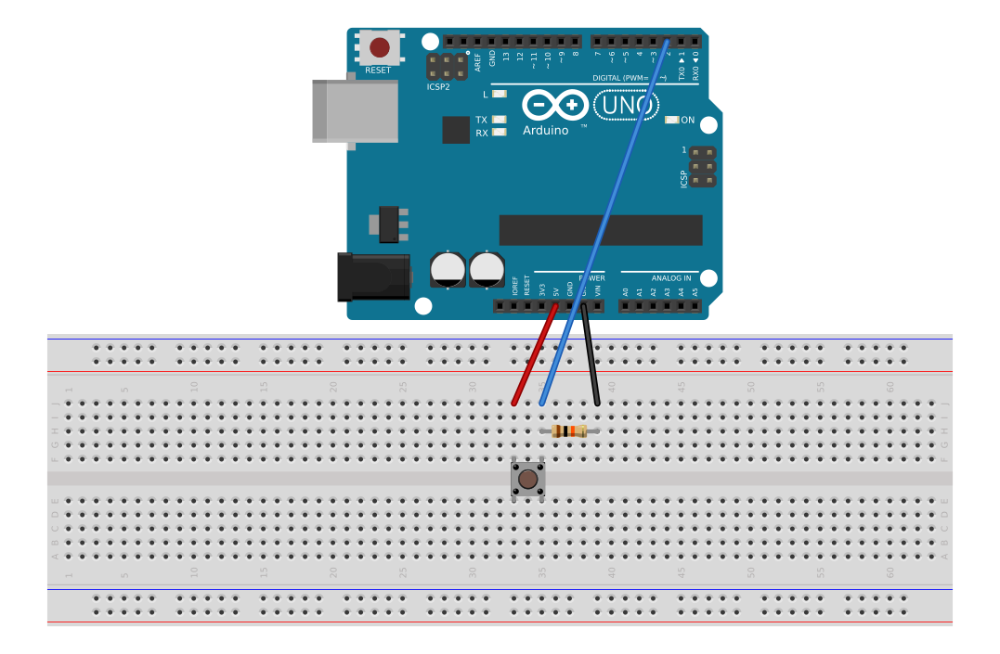
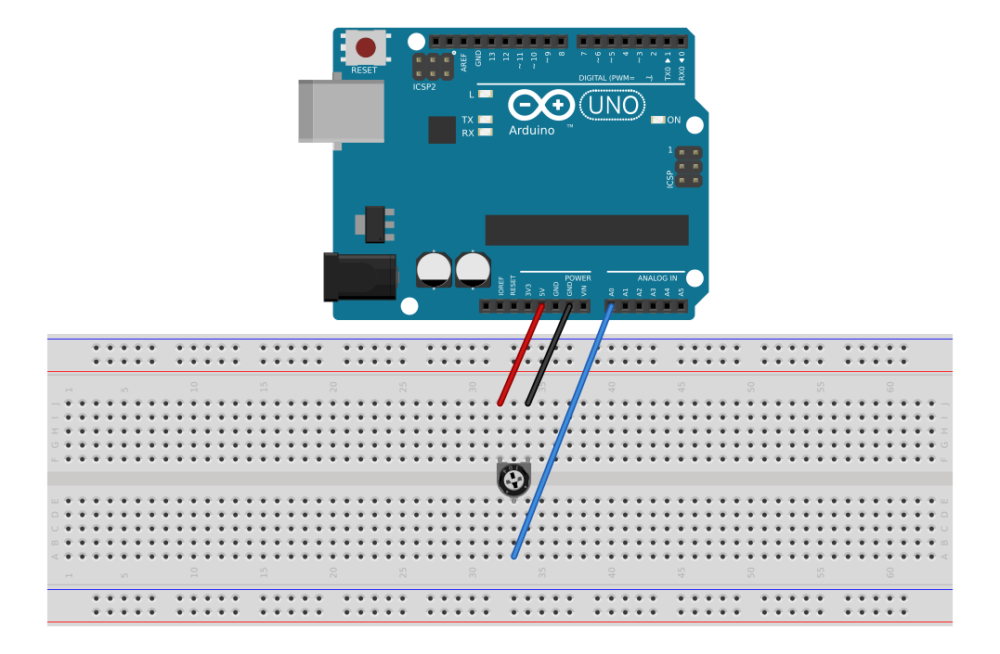

.. _Hallo Welt mit Arduino:
.. _Arduino-Programmbeispiel:
.. _Ein erstes Arduino-Programmbeispiel:

Erste Arduino-Programmbeispiele
===============================

Das erste Beispiel in jeder Programmiersprache ist es, einfach den Text "Hallo
Welt" auf dem Bildschirm auszugeben. Arduinos kommunizieren allerdings weniger
mit dem Computer-Bildschirm als vielmehr bevorzugt mit anderen elektronischen
Komponenten. Ein einfaches Minimal-Beispiel ist also beispielsweise eine
einzelne LED zum Blinken zu bringen.

.. _Blinken einer LED:

Blinken einer LED
-----------------

In der Arduino-IDE kann man über das Menü ``Datei -> Beispiele`` einige
Beispiel-Quellcode-Dateien laden. Unter der Rubrik ``01.Basics``
findet sich beispielsweise der Eintrag "Blink" mit folgendem Inhalt:

.. code-block:: c
    :linenos:

    // Pin 13 has an LED connected on most Arduino boards.
    // give it a name:
    int led = 13;

    // the setup routine runs once when you press reset:
    void setup() {
      // initialize the digital pin as an output.
      pinMode(led, OUTPUT);
    }

    // the loop routine runs over and over again forever:
    void loop() {
      digitalWrite(led, HIGH);   // turn the LED on (HIGH is the voltage level)
      delay(1000);               // wait for a second
      digitalWrite(led, LOW);    // turn the LED off by making the voltage LOW
      delay(1000);               // wait for a second
    }

Der zugehörige Aufbau sieht etwa folgendermaßen aus:

Jeder Text, der hinter einem doppelten Schrägstrich-Zeichen ``//`` erscheint,
wird vom Compiler ignoriert und dient somit lediglich als Kommentar für sich
selbst und/oder andere Programmierer.
Allgemein werden die Arduino-Programme mit einer Syntax geschrieben, die auf der
Programmiersprache :ref:`C <gwic:Grundkurs C>`  aufbaut; beispielsweise muss
daher jede einzelne Anweisung mit einem Strichpunkt-Zeichen beendet werden.

Eine Besonderheit ist, dass *jedes* Arduino-Programm eine Funktion ``setup()``
und eine Funktion ``loop()`` beinhalten muss:

* Die Funktion ``setup()`` wird einmalig nach dem Aufspielen eines neuen
  Programms sowie bei jedem Neustart des Arduinos ausgeführt.

* Die Funktion ``loop()`` beinhaltet Code, der anschließend in einer
  Endlos-Schleife ausgeführt wird: Ist die letzte Zeile der ``loop()``-Funktion
  erreicht, so wird anschließend wieder die erste Zeile dieser Funktion
  ausgeführt.

Die Funktionsblöcke der ``setup()``- beziehungsweise ``loop()``-Funktion müssen
nicht zwingend Code beinhalten; lässt man beide Blöcke leer und überträgt dieses
Programm auf den Arduino, so wird jedes vorherige Programm gelöscht, und der
Arduino ist "wie neu". [#]_

Im obigen Beispiel wird innerhalb der ``setup()``-Funktion mittels der
vordefinierten ``pinMode()``-Funktion der Digital-Pin ``13`` als Ausgabe-Pin
festgelegt (``OUTPUT``). Innerhalb der ``loop()``-Funktion wird an diesem dann
mittels der ebenfalls vordefinierten ``digitalwrite()``-Funktion die
Ausgangs-Spannung abwechselnd an- und ausgeschaltet. Damit dies für das
menschliche Auge wahrnehmbar wird -- ein Arduino kann rund :math:`20\,000`
Zeilen Code je Sekunde ausführen -- wird mittels der ``delay()``-Funktion das
Programm immer wieder um die angegebene Anzahl an Milli-Sekunden unterbrochen.

.. _Einfache Sensor-Schaltungen:

Einfache Sensor-Schaltungen
---------------------------

In diesem Abschnitt soll zunächst die Verwendung eines Tasters als digitalem
Sensor, später dann die Verwendung eines Potentiometers als analogem Sensor kurz
vorgestellt werden.

.. _Taster als Digital-Sensor:

Taster als Digital-Sensor
^^^^^^^^^^^^^^^^^^^^^^^^^

In der Arduino-IDE kann man über das Menü ``Datei -> Beispiele`` ein
Beispielprogramm für die Verwendung eines Eingabe-Tasters. Unter der Rubrik
``01.Basics`` findet sich ein Eintrag "DigitalReadSerial" mit folgendem Inhalt:
[#]_

.. code-block:: c
    :linenos:

    /*
      DigitalReadSerial
     Reads a digital input on pin 2, prints the result to the serial monitor

     This example code is in the public domain.
     */

    // digital pin 2 has a pushbutton attached to it. Give it a name:
    int pushButton = 2;

    // the setup routine runs once when you press reset:
    void setup() {
      // initialize serial communication at 9600 bits per second:
      Serial.begin(9600);
      // make the pushbutton's pin an input:
      pinMode(pushButton, INPUT);
    }

    // the loop routine runs over and over again forever:
    void loop() {
      // read the input pin:
      int buttonState = digitalRead(pushButton);
      // print out the state of the button:
      Serial.println(buttonState);
      delay(1);        // delay in between reads for stability
    }

Die zugehörige Schaltung sieht etwa folgendermaßen aus:

Der digitale ``Pin 2``, der in diesem Beispiel als Sensor-Eingang verwendet
werden soll, ist einerseits über einen :math:`\unit[10]{k
\Omega}`-Widerstand mit ``GND``, andererseits über den Eingabetaster mit der
Spannung ``VCC`` (:math:`\unit[5]{V}`) verbunden. Diese Schaltung stellt
letztlich einen :ref:`Spannungsteiler <Spannungsteiler>` dar, wobei der Taster
die Rolle des ersten Widerstands :math:`R_1` übernimmt:

* Ist der Taster gedrückt, so beträgt sein Widerstandswert nahezu :math:`R_1 =
  \unit[0]{\Omega}`; fast die gesamte die gesamte anliegende Spannung fällt
  somit über dem Widerstand :math:`R_2 = \unit[10]{k \Omega}`, also zwischen dem
  mit ``Pin 2`` verbundenen Punkt und ``GND`` ab. Am ``Pin 2`` wird somit eine
  Spannung von :math:`\unit[>2,5]{V}` gemessen, was beim Einlesen mittels der
  ``digitalRead()``-Funktion den Wert ``HIGH`` beziehungsweise ``1``
  liefert.

* Ist der Taster nicht gedrückt, so beträgt sein Widerstandswert nahezu
  :math:`R_1 = \unit[\infty]{\Omega}`. Würde man den ``Pin 2`` nicht über einen
  Widerstand mittels ``GND`` verbinden, so hinge der Anschluss gewissermaßen "in
  der Luft" -- die ``digitalRead()``-Funktion würde dann zufällig entweder den
  Wert ``HIGH`` (``1``) oder ``LOW`` (``0``) ausgeben. Durch den Widerstand und
  den so geschlossenen Stromkreis ist ``Pin 2`` hingegen mit ``GND`` verbunden,
  und die ``digitalRead()``-Funktion gibt verlässlich den Wert ``LOW``
  beziehungsweise ``0`` aus.

.. _Serieller Monitor:
.. _Serieller Monitor -- Anzeige der Sensor-Werte:

.. rubric:: Serieller Monitor -- Anzeige der Sensor-Werte

Ist der Arduino mittels eines USB-Kabels mit dem Computer verbunden, so können
dort mittels des so genannten "Seriellen Monitors" die Eingabe-Werte des Sensors
zum jeweils aktuellen Zeitpunkt angezeigt werden.

.. _Potentiometer als Analog-Sensor:

Potentiometer als Analog-Sensor
^^^^^^^^^^^^^^^^^^^^^^^^^^^^^^^

Über das Menü ``Datei -> Beispiele`` kann man unter der Rubrik ``01.Basics``
ebenfalls ein Beispielprogramm für die Verwendung eines Potentiometers als
Analog-Sensors abrufen. Das Beispiel "AnalogReadSerial" hat folgenden Inhalt:

.. code-block:: c
    :linenos:

    /*
      AnalogReadSerial
      Reads an analog input on pin 0, prints the result to the serial monitor.
      Attach the center pin of a potentiometer to pin A0, and the outside pins
      to +5V and ground.

      This example code is in the public domain.
    */

    // the setup routine runs once when you press reset:
    void setup() {
        // initialize serial communication at 9600 bits per second:
        Serial.begin(9600);
    }

    // the loop routine runs over and over again forever:
    void loop() {
        // read the input on analog pin 0:
        int sensorValue = analogRead(A0);
        // print out the value you read:
        Serial.println(sensorValue);
        delay(1);        // delay in between reads for stability
    } 

Die zugehörige Schaltung sieht etwa folgendermaßen aus:

Der Analog-Pin ``A0`` ist in diesem Beispiel mit dem mittleren Anschluss eines
Potentiometers (beispielsweise :math:`\unit[10]{k \Omega}`) verbunden; die
äußeren Anschlüsse des Potentiometers sind mit ``5V`` beziehungsweise mit
``GND`` verbunden. Die Schaltung stellt somit wiederum einen
:ref:`Spannungsteiler <Spannungsteiler>` dar, wobei das Verhältnis der
Teilwiderstände :math:`R_1` und :math:`R_2` mittels des Potentiometers variiert
werden können.

.. raw:: html

    

.. only:: html

    .. rubric:: Anmerkungen:

.. [#] Allgemein kann der Mikrocontroller Atmega328 eines Arduino-UNO-Boards gut
    :math:`10\,000` mal neu beschrieben werden; zudem kann auf dem Board
    jederzeit der Mikrocontroller durch einen neuen ersetzt werden.

.. [#] Als Alternative zu diesem Programm kann auch unter der Rubrik
    ``02.Digital`` das Beispielprogramm ``Button`` gewählt werden. Dieses ist
    strukturell sehr ähnlich, bietet umfangreichere Erklärungen zum Aufbau der
    Schaltung, lässt andererseits jedoch den seriellen Monitor außen vor.

