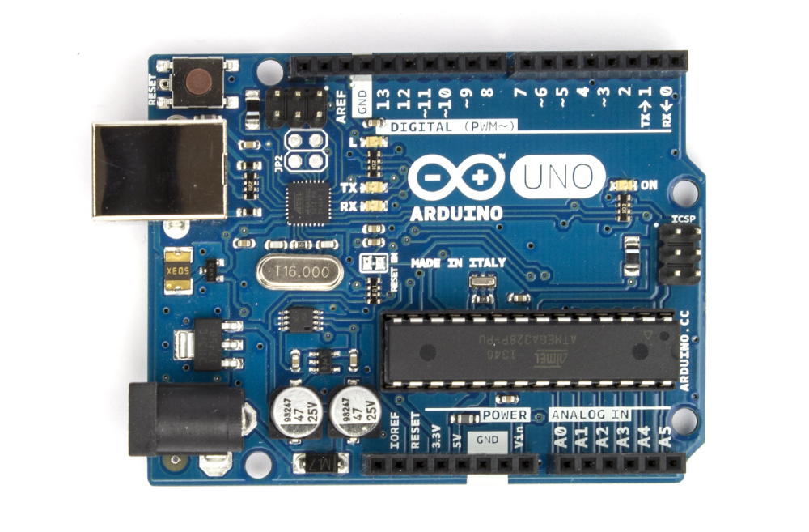

.. index:: Arduino
.. _Elektronik mit Arduinos:

Elektronik mit Arduinos
=======================

Arduinos sind kleine Entwickler-Boards, die einen programmierbaren
Mikrocontroller enthalten; sie lassen sich via USB mit einem Computer verbinden
und lassen sich bei entsprechender Programmierung für vielseitige
Elektronik-Projekte einsetzen.

    Das Entwicklerboard Arduino UNO.

    .. only:: html

        :download:`SVG: Arduino UNO
        <../pics/arduino/arduino-uno.svg>`

Einen Mikrocontroller kann man sich allgemein als einen winzigen Computer
vorstellen; er vereinigt eine Recheneinheit (CPU), einen Arbeitsspeicher, einen
permanenten Speicher, eine USB-Schnittstelle, einen Display-Controller sowie
einen Analog-Digital-Wandler auf einem einzigen Bauteil. Selbstverständlich ist
ein Mikrocontroller, was die Performance anbelangt, nicht mit einem "echten"
Computer zu vergleichen; für einfache Sensor- oder Steuerungs-Schaltungen
reichen Mikrocontroller jedoch meist völlig aus.

Im folgenden werden verschiedene Projekte für Arduino-UNO-Boards vorgestellt.
Diese "klassischen" Arduinos enthalten den Mikrocontroller "ATmega328", der
optional sogar vom Arduino-Board entnommen und direkt in elektronische
Schaltungen eingebaut werden kann. Da ein ATmega328 als Baustein nur etwa drei
Euro kostet, kann man Arduino-Boards also auch als Programmier-Hilfe für diese
Bausteine nutzen.

.. toctree::
    :maxdepth: 2

    aufbau.rst
    installation.rst
    erste-beispiele.rst
    arduino-programmierung.rst

... to be continued ...

.. _Arduino-Links:

Links
-----

* `Arduino-Arbeitsheft für Schüler
  <http://gymnasium-ochsenhausen.de/homepage/wp-content/uploads/2016/02/Arduino-Skript_04122015.pdf>`__
* `Arduino-Projekte (Kreative Kiste) <https://www.kreativekiste.de/elektro/arduino-projekte>`__
* `Arduino-Tutorial von Frerk Popovic <http://popovic.info/html/arduino/arduinoUno_1.html>`__

.. http://daeges-ulm.de/schule-und-co/nwt/nwt-10/

.. https://processing.org/examples/

