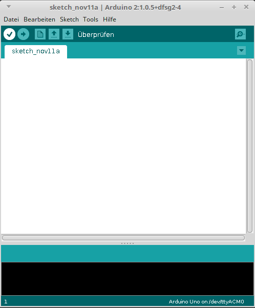

.. index:: Arduino; Software (IDE)
.. _Installation der Arduino-Software:

Installation der Arduino-Software
=================================

Damit ein Arduino die gewünschte Funktion erfüllen kann, muss er programmiert
werden. Dafür benötigt man lediglich die gleichnamige
Arduino-Entwicklungsumgebung und/oder das Programm "Fritzing" (optional, aber
empfohlen). Unter Linux Mint / Ubuntu lassen sich diese beiden
Programme folgendermaßen installieren:

.. code-block:: sh

    # Software-Pakete installieren:
    sudo aptitude install arduino fritzing

    # Benutzer zur Gruppe "dialout" hinzufügen:
    sudo usermod -aG dialout BENUTZERNAME

Das Hinzufügen des angegebenen Benutzers zur Gruppe ``dialout`` ist nötig, damit
dieser vom Linux-System notwendige Schreibrechte erhält: Schließt man ein
Arduino-Board via USB am Computer an, so benötigt man diese Schreibrechte, um
mittels des so genannten "Seriellen Ports" Code an den Arduino senden zu können.
[#]_

**Wichtig:** Die Rechte-Anpassung erfordert einen erneuten Login des Benutzers,
um wirksam zu werden!

Nach der Installation kann die Arduino-Software aus einer Shell heraus mittels
``arduino`` oder über ``Startmenü -> Entwicklung -> Arduino IDE`` gestartet
werden.

    Die Arduino-Entwicklungsumgebung.

Im Hauptfenster des Programms kann wie mit einem Texteditor Quellcode eingegeben
werden. Unten links wird die Nummer der aktuellen Zeile im Quellcode
eingeblendet, unten rechts das derzeit ausgewählte Arduino-Board (Standard:
Arduino UNO); ein anderes Arduino-Board über das Menü ``Tool -> Boards``
ausgewählt werden.

* Hat man den gewünschten Quellcode eingegeben, so kann man diesen mittels des
  ``Überprüfen``-Icons in der Symbolleiste auf Syntax-Fehler testen.

  .. image:: ../pics/arduino/arduino-symbol-check.png
      :align: center

* Wurde der Syntax-Check ohne Fehlermeldung durchlaufen, so kann man den Code
  kompilieren und an das Arduino-Board senden. Hierzu genügt ein Klick auf das
  ``Upload``-Icon in der Symbolleiste:
  "Überprüfen"-Icons in der Symbolleiste auf Syntax-Fehler testen.

  .. image:: ../pics/arduino/arduino-symbol-upload.png
      :align: center

Der Syntax-Check ist optional, man kann auch unmittelbar auf das Upload-Icon
klicken, wenn man den Code kompilieren und an das Arduino-Board senden möchte.
Falls während des Kompilierens oder des Sendens ein Fehler auftritt, so werden
im unteren Teil des Arduino-Fensters entsprechende Meldungen ausgegeben, die bei
der Fehlersuche hilfreich sein können.

.. raw:: html

    

.. only:: html

    .. rubric:: Anmerkungen:

.. [#] Hat man ein Arduino-Board angeschlossen, kann man in einer Shell
    folgende Zeile eingeben:

    ``ls -l /dev/ttyACM*``

    Der serielle USB-Port wird vom Linux-System automatisch als "Device"
    erkannt; die Kommunikation findet über eine sich im ``/dev/``-Verzeichnis
    befindende Datei dort befindende Datei namens ``ttyACM0``, ``ttyACM1`` o.ä.
    statt (`tty <https://de.wikipedia.org/wiki/TTY-Schnittstelle>`__ bezeichnet
    dabei die serielle Schnittstelle und `acm
    <https://de.wikipedia.org/wiki/Adaptive_Coding_and_Modulation>`__ das
    Datenübertragungs-Verfahren). Man erhält dabei also folgende Ausgabe:

    ``crw-rw---- 1 root dialout 188, 0 5 apr 23.01 ttyACM0``

    Man kann daran erkennen, dass sowohl der Eigentümer als auch die Gruppe
    Lese- und Schreibrechte haben ``rw-``, alle anderen Benutzer hingegen keine
    Rechte haben (``---``). Der Eigentümer ist ``root``, die Gruppe ist
    ``dialout``. Ein Benutzer kann also nur auf die serielle Schnittstelle
    zugreifen, wenn er die Arduino-Software mit SuperUser-Rechten startet oder
    (besser) wenn er Mitglied in der ``dialout``-Gruppe ist.

