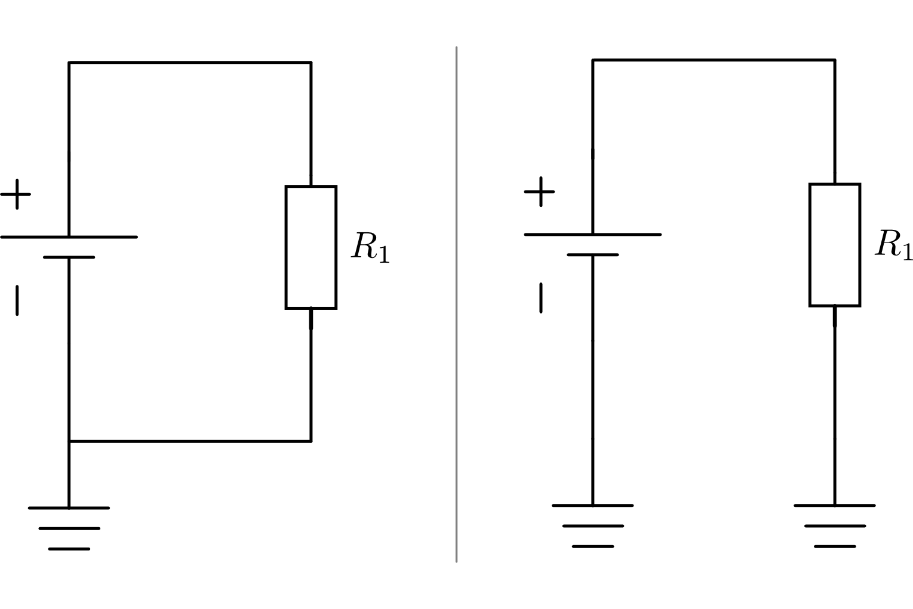

.. _Leitung:

Leitungen
=========

Damit die einzelnen Bauteile eines Stromkreises miteinander verbunden werden
können, sind Leitungen nötig. Verbindungskabel bestehen meist aus Kupferdraht,
der durch eine isolierende Kunststoffhülle ummantelt ist. In Leiterplatten
("Platinen") befinden sich metallische Leiterbahnen in einem isolierenden
Trägermaterial (meistens Glasfasern mit Epoxidharz).

In Schaltplänen werden Leitungen durch gerade oder abgewinkelte
Verbindungslinien dargestellt:

.. figure::
    ../pics/bauteile/schaltzeichen-leitung.png
    :name: fig-schaltzeichen-leitung
    :alt:  fig-schaltzeichen-leitung
    :align: center
    :width: 20%

    Schaltzeichen einer Leitung.

    .. only:: html

        :download:`SVG: Schaltzeichen Leitung
        <../pics/bauteile/schaltzeichen-leitung.svg>`

In Schaltplänen muss der Verlauf der Leitungen, ähnlich wie in
Straßenbahn-Plänen, nicht mit dem tatsächsächlichen Verlauf der Leitungen in
einer realen Schaltung übereinstimmen. So können beispielsweise Schaltpläne
unter Umständen durch ein zusätlizchen Einzeichnen eines Knicks übersichtlicher
gestaltet werden, während in der tatsächlichen Schaltung das Kabel an dieser
Stelle linear verläfut. Leitungen in Schaltplänen geben also vielmehr an, *dass*
Bauteile miteinander verbunden sind, nicht wie sie physikalisch angeordnet sind
oder wie lang die Leitungen tatsächlich sind.

.. _Kreuzungen und Verbindungen:

Kreuzungen und Verbindungen
---------------------------

Sind -- insbesondere bei komplexeren Schaltungen -- Leiterkreuzungen
unvermeidbar, so wird im Normalfall angenommen, dass kein leitender Kontakt
zwischen den sich kreuzenden Leitern besteht.

.. figure::
    ../pics/bauteile/schaltzeichen-leitung-kreuzung.png
    :name: fig-schaltzeichen-leitung-kreuzung
    :alt:  fig-schaltzeichen-leitung-kreuzung
    :align: center
    :width: 20%

    Schaltzeichen einer Leitungs-Kreuzung.

    .. only:: html

        :download:`SVG: Schaltzeichen Leitungs-Kreuzung
        <../pics/bauteile/schaltzeichen-leitung-kreuzung.svg>`

Eine leitende Verbindung zweier (oder mehrerer) Leiter wird in Schaltplänen
explizit mit einem schwarzen Punkt gekennzeichnet.

.. figure::
    ../pics/bauteile/schaltzeichen-leitung-verbindung.png
    :width: 20%
    :align: center
    :name: fig-schaltzeichen-leitung-verbindung
    :alt:  fig-schaltzeichen-leitung-verbindung

    Schaltzeichen einer Leitungs-Verbindung.

    .. only:: html

        :download:`SVG: Schaltzeichen Leitungs-Verbindung
        <../pics/bauteile/schaltzeichen-leitung-verbindung.svg>`

.. index:: Massse, Ground
.. _Masse:

Die Masse (Ground)
------------------

Die von einer Stromquelle bereitgestellte Spannung bezieht sich stets auf ein
Grundniveau; dieses beträgt normalerweise :math:`\unit[0]{V}` und wird als
"Masse" (auch "Ground" oder "GND") bezeichnet. Sowohl positive wie auch negative
Spannungen, die bei Wechselstrom-Schaltungen auftreten, beziehen sich auf dieses
Grundniveau. Bei Gleichstrom-Schaltungen entspricht das Masse-Niveau meist dem
negativen Pol der Stromquelle.

.. figure::
    ../pics/bauteile/schaltzeichen-masse.png
    :name: fig-schaltzeichen-masse
    :alt:  fig-schaltzeichen-masse
    :align: center
    :width: 20%

    Schaltzeichen der Masse (GND).

    .. only:: html

        :download:`SVG: Schaltzeichen Masse
        <../pics/bauteile/schaltzeichen-masse.svg>`

In Schaltplänen sind oft sehr viele Leitungen mit der Masse verbunden. Um
Leitungskreuzungen zu vermeiden, die Schaltpläne oftmals unübersichtlich
erscheinen lassen, werden oftmals die Leitungen zum Masse-Anschluss
"abgeschnitten" und stattdessen das Masse-Symbol eingezeichnet. 

    Unterschiedliche Darstellungsformen für die Verbindung eines Bauteils mit
    dem Masse-Niveau.

    .. only:: html

        :download:`SVG: Masse-Anschluss
        <../pics/schaltungen/masse-anschluss.svg>`

In umfangreicheren Schaltungen wird bevorzugt die zweitere Variante gewählt, da
sich hierdurch unüberslichtliche Leitungen beziehungsweise Leitungskreuzungen
vermieden werden können. In einer realen Schaltung müssen alle derartigen "mit
Masse verbundenen" Punkte selbstverständlich auch physisch miteinander verbunden
sein.

.. _Feinsicherung:

Feinsicherungen
---------------

Feinsicherungerungen werden eingesetzt, um in einem Stromkreis zu hohe
Stromflüsse und damit eine mögliche Beschädigung der Bauteile zu verhindern.
Dazu besteht eine Feinsicherung aus einem sehr dünnen Draht in einer
Glashülle, der bei einer zu großen Stromstärke "durchschmilzt".

.. figure::
    ../pics/bauteile/schaltzeichen-sicherung.png
    :name: fig-schaltzeichen-sicherung
    :alt:  fig-schaltzeichen-sicherung
    :align: center
    :width: 20%

    Schaltzeichen einer Sicherung.

    .. only:: html

        :download:`SVG: Schaltzeichen Sicherung
        <../pics/bauteile/schaltzeichen-sicherung.svg>`

.. Schutzschalter, Sicherungsautomat..
.. Kurzschluss; Geraeteschluss: Normalerweise isoliertes Metallisches Gehaeuse geraet unter Spannung.
 ..
     Schuko-Stecker; Aussen- und Nullleiter ueber Steckstifte mit Kontakten der
     Steckdose verbunden; Durch Aussenleiter fliesst Strom, Nullleiter ist
     geerdet. Zusaetzliche Sicherung: Dritter Leiter, gelb-gruener Schutzleiter,
     mit Metallgehaeuse verbunden. Wenn Gehaeuse durch fehlerhafte Isolierung
     des Aussenleiters unter Spannung steht, fuehrt der Schutzleiter den Strom
     zur Erde ab -> Kurzschluss; Sicherung wird "herausfliegen", Stromzufuhr
     unterbrochen.

