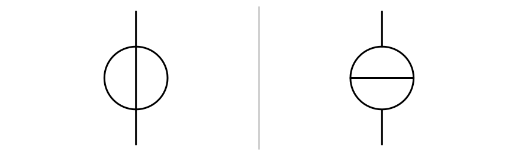
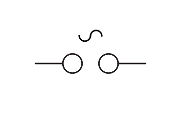
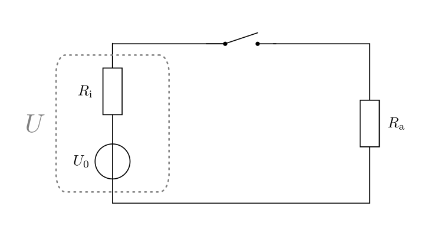
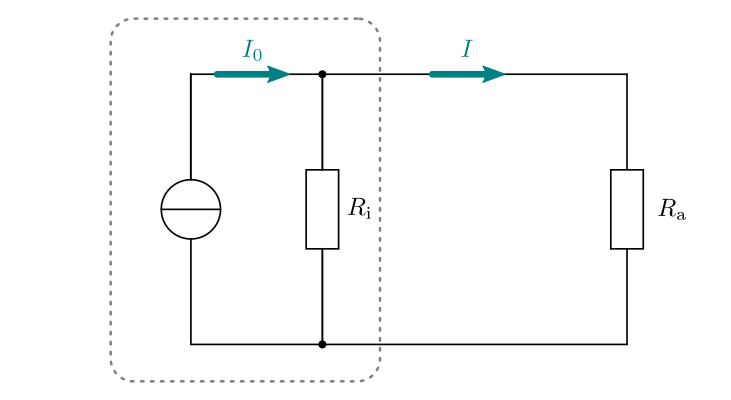

.. index:: Stromquelle
.. _Spannungs- und Stromquellen:

Spannungs- und Stromquellen
===========================

Damit in einem Stromkreis ein elektrischer Strom fließen kann, muss eine
elektrische Spannung anliegen. Umgangssprachlich wird diese von einer
"Stromquelle" bereitgestellt; in der Elektronik unterscheidet man hingegen
zwischen "Spannungsquellen" und "Stromquellen":

* Eine ideale Spannungsquelle liefert eine konstanten Spannungswert, unabhängig
  von der Größe der Stromstärke, die der Quelle entnommen wird.

  .. figure::
      ../pics/bauteile/diagramm-ideale-spannungsquelle.png
      :name:  fig-diagramm-ideale-spannungsquelle
      :alt:   fig-diagramm-ideale-spannungsquelle
      :align: center
      :width: 40%

      :math:`U(I)`-Diagramm einer idealen Spannungsquelle.

      .. only:: html

          :download:`SVG: Ideale Spannungsquelle
          <../pics/bauteile/diagramm-ideale-spannungsquelle.svg>`

* Eine ideale Stromquelle liefert stets die gleiche Stromstärke; die zum Liefern
  dieser Stromstärke nötige Spannung wird von der Stromquelle automatisch
  geregelt.

  .. figure::
      ../pics/bauteile/diagramm-ideale-stromquelle.png
      :name:  fig-diagramm-ideale-stromquelle
      :alt:   fig-diagramm-ideale-stromquelle
      :align: center
      :width: 40%

      :math:`U(I)`-Diagramm einer idealen Stromquelle.

      .. only:: html

          :download:`SVG: Ideale Stromquelle
          <../pics/bauteile/diagramm-ideale-stromquelle.svg>`

Beide Typen sind idealisierte Modelle, die es in der Realität so nicht geben
kann: Könnte beispielsweise bei einer idealen Spannungsquelle tatsächlich ein
beliebig großer Strom entnommen werden, so würde auch die bereitgestellte
Leistung gemäß der Formel :math:`P = U \cdot I` beliebig groß werden. Bei realen
Spannungsquellen sinkt daher die Spannung, wie unten im :ref:`Exkurs:
Innenwiderstand realer Spannungsquellen <Exkurs Innenwiderstand realer
Spannungsquellen>` näher beschrieben wird, bei zunehmend größeren Stromstärken
ab; gleichermaßen können reale Stromquellen keine beliebig großen Spannungswerte
liefern, die bei großen Last-Widerständen nötig wären, um die Soll-Stromstärke
aufrecht zu erhalten. 

    Schaltzeichen einer idealen Spannungs- beziehungsweise Stromquelle.

    .. only:: html

        :download:`SVG: Schaltzeichen ideale Spannungs- und Stromquelle
        <../pics/bauteile/schaltzeichen-ideale-spannungs-und-stromquelle.svg>`

Die idealen Modelle werden aufgrund ihrer Einfachheit dennoch verwendet, da sie
oftmals die realen Vorgänge bereits gut genug beschreiben können; ergeben sich
bei Verwendung dieser einfachen Modelle Widersprüche oder (bei Rechnungen)
unrealistische Werte, so müssen diese -- wie am am Ende dieses Kapitels näher
beschrieben -- nachgebessert werden.

.. _Spannungsquellen mit Gleichspannung:

Spannungsquellen mit Gleichspannung
-----------------------------------

.. Da viele elektronische Bauteile ausschließlich mit Gleichspannung
.. funktionieren, haben Gleichspannungsquellen eine besondere Bedeutung.

Am Minuspol einer Spannungsquelle besteht ein Elektronenüberschuss, am Pluspol
ein Elektronenmangel. Beide Zustände werden durch Vorgänge im Inneren der
Spannungsquelle erzeugt beziehungsweise aufrecht erhalten.

.. _Batterie:
.. _Batterien:

.. rubric:: Batterien

Batterien haben chemische Energie im Inneren gespeichert und sind in der Lage,
diese in Form von elektrischer Energie freizusetzen. Entladene Batterien, deren
gespeicherte Energiemenge verbraucht ist, müssen an einer Wertstoff-Sammelstelle
abgegeben oder in speziell dafür aufgestellte Container geworfen werden. [#]_
Auf diese Weise können die Bestandteile der Batterie (weitgehend) wieder
verwertet werden, und es gelangen zumindest weitaus weniger Giftstoffe in die
Umwelt.

    Schaltzeichen einer Batterie beziehungsweise eines Akkumulators.

    .. only:: html

        :download:`SVG: Schaltzeichen Batterie (Gleichspannung)
        <../pics/bauteile/schaltzeichen-batterie-akkumulator.svg>`

Batterien können nicht wieder aufgeladen werden und weisen somit gegenüber
Akkumulatoren sowohl aus wirtschaftlicher wie aus ökologischer Sicht erhebliche
Nachteile auf. Sie werden normalerweise nur dann in mobilen Bereichen
eingesetzt, wenn eine vergleichsweise höhere Speicherkapazität und/oder eine
geringfügig höhere Leistungsabgabe zwingend erforderlich sind.

.. _Akkumulator:
.. _Akkumulatoren:

.. rubric:: Akkumulatoren

Akkumulatoren (auch "Akkus genannt) sind "wiederaufladbare Batterien". Beim
Aufladen wird elektrische Energie in Form von chemischer Energie durch die
Umwandlung von Stoffen im Inneren des Akkus gespeichert. Beim Entladen läuft der
chemische Prozess in umgekehrter Richtung ab, und es wird elektrische Energie
freigegeben.

*Beispiele:*

* Blei-Akkumulator:

  Im ungeladenen Zustand bestehen die Platten aus Bleisulfat
  :math:`(\ce{PbSO4})`. Beim Aufladen reagiert die positive Elektrode zu
  Bleioxid :math:`(\ce{PbO2})` und die negative Elektrode zu Blei
  :math:`(\ce{Pb})`. Als Elektrolyt wird verdünnte Schwefelsäure verwendet.

  Die Spannung je Zelle beträgt etwa :math:`\unit[2]{V}`. In handelsüblichen
  Blei-Akkumulatoren sind meistens sechs Zellen in einer Reihenschaltung
  miteinander verbunden, so dass an den Anschlüssen eine Spannung von
  :math:`\unit[12]{V}` abgegriffen werden kann.

* Nickel-Eisen-Akkumulator:

  Als Elektrolyt wird verdünnte Kali-Lauge verwendet; die Spannung je Zelle
  beträgt etwa :math:`\unit[1,2]{V}`.

..  - Nickel-Cadmium-Akkumulator

Bei geringen Stromstärken können Batterien und Akkumulatoren in guter Näherung
als ideale Spannungsquellen angesehen werden.

.. _Netzteile:

.. rubric:: Netzteile

Für stationäre Anwendungen haben (kabelgebundene) Netzteile mehrere Vorteile
gegenüber Batterien oder Akkumulatoren: Sie müssen nicht ausgetauscht werden,
und liefern stets zuverlässig (ohne Entladungs-Erscheinungen) die gewünschte
Spannung.

Gleichspannungs-Netzteile ("DC" beziehungsweise "Direct Current") bestehen
normalerweise aus einem Transformator, einem (Brücken-)Gleichrichter, einem
Spannungsregler und einigen Kondensatoren. Je nach Typ des eingebauten
Spannungsreglers liefern Netzteile eine feste oder einstellbare
Ausgangs-Spannung.

.. .. rubric:: Solarzellen

.. Solarzellen werden, häufig in Kombination mit Akkumulatoren, sowohl in
.. stationären wie in mobilen Anwendungsbereichen mit geringem Stromverbrauch
.. eingesetzt. Je nach Modulgröße liefern sie unterschiedlich hohe Spannungen
.. beziehungsweise Stromstärken.

.. Solarzellen sind eher Strom- als Spannungsquellen!
.. nach Clifford Block 19 bei 27min50

.. _Spannungsquellen mit Wechselspannung:

Spannungsquellen mit Wechselspannung
------------------------------------

Haushalts-Steckdosen stellen eine Wechselspannung von :math:`\unit[230]{V}`
bereit, wobei die zulässige Stromstärke durch Sicherungen meist auf
:math:`\unit[16]{Ampere}` begrenzt ist -- es kann somit eine maximale
elektrische Leistung von :math:`\unit[230]{V} \cdot \unit[16]{A} =
\unit[3680]{W}` abgegriffen werden. Die elektrische Spannung wird in Kraftwerken
mittels Generatoren (oder mittels Solarzellen und Wechselrichtern) erzeugt und
-- nach eine Spannungsanpassung -- über (Hoch-)Spannungsleitungen an die
jeweiligen Orte übertragen.

    Schaltzeichen eines Netzteils mit Wechselspannung.

    .. only:: html

        :download:`SVG: Schaltzeichen Netzteil (Wechselspannung)
        <../pics/bauteile/schaltzeichen-netzteil-wechselspannung.svg>`

..  beziehungsweise ein direkter Anschluss elektrischer Bauteile an den

Während elektrische Experimente mit "Netzspannung" aufgrund der hohen
elektrischen Leistung lebensgefährlich (!!) sind, kann die Wechselspannung des
Stromnetzes :math:`(\unit[230]{V})` mittels eines Transformators einfach auf
eine geringere Spannung eingestellt werden. Je nach Bauweise können sich
Transformatoren entweder direkt in den Geräten befinden (beispielsweise in
Fernsehgeräten, Radios usw.), oder in Form von separaten Netzteilen vorliegen
(beispielsweise bei Notebooks).

Auch für Elektronik-Versuche mit Wechselspannung sollte stets ein geeignetes
Wechselspannungs-Netzteil ("AC" beziehungsweise "Alternating Current") verwendet
werden.

.. _Stromquellen:

Stromquellen
------------

So wie eine ideale Spannungsquelle stets die gleiche Nenn-Spannung liefert,
liefert eine ideale Stromquelle stets einen gleichen Nenn-Strom; die dafür
benötigte Spannung wird von der Stromquelle automatisch geregelt. Wie sich
erahnen lässt, lassen sich in der Praxis reale Stromquellen nur schwerer
verwirklichen als Spannungsquellen.

Manche Labor-Netzteile können innerhalb bestimmter Grenzen wahlweise als Strom-
oder Spannungsquelle genutzt werden; verwendet man den Stromquellen-Modus, so
lässt sich zudem der gewünschte Nenn-Strom einstellen, beispielsweise
:math:`\unit[1]{A}`. Stellt die Stromquelle dann fest, dass sie aktuell nur
:math:`\unit[50]{mA}` abgibt, so erhöht sie intern immer weiter ihre Spannung,
solange bis sich die gewünschte Stromstärke einstellt oder technische Grenzen
erreicht sind.

.. index:: Innenwiderstand, Außenwiderstand, Lastwiderstand

.. _Exkurs Innenwiderstand realer Spannungsquellen:

Exkurs 1: Innenwiderstand realer Spannungsquellen
-------------------------------------------------

Wird ein Stromkreis geschlossen, so muss der Strom -- unabhängig von der Art der
Spannungsquelle -- stets auch durch diese selbst hindurch fließen. Reale
Spannungsquellen haben hierbei einen eigenen elektrischen Widerstand, den man
"Innenwiderstand" :math:`R_{\mathrm{i}}` nennt -- in Unterscheidung zu den
angeschlossenen Verbrauchern, die man unter dem Begriff "Außenwiderstand"
:math:`R_{\mathrm{a}}` (beziehungsweise  "Lastwiderstand :math:`R_{\mathrm{L}}`)
zusammenfasst.

    Modell einer realen Spannungsquelle mit der Leerlaufspannung
    :math:`U_0` und dem Innenwiderstand :math:`R_{\mathrm{i}}`.

    .. only:: html

        :download:`SVG: Reale Spannungsquelle (Modell)
        <../pics/bauteile/reale-spannungsquelle.svg>`

Der Gesamtwiderstand :math:`R_{\mathrm{ges}}` eines Stromkreises ist gleich der
Summe aus dem Innenwiderstand der Spannungsquelle und dem Außenwiderstand:

.. math::

    R_{\mathrm{ges}} = R_{\mathrm{i}} + R_{\mathrm{a}}

Wie bei einer :ref:`Reihenschaltung von Widerständen <Reihenschaltung von
Widerständen>` üblich, fällt ein Teil der Gesamtspannung am Innenwiderstand und
der restliche Teil am Außenwiderstand ab. Welcher Anteil der Gesamtspannung am
Außenwiderstand abfällt, hängt vom Anteil :math:`\frac{R_{\mathrm{a}}}{R_{\mathrm{ges}}}`
des Außenwiderstands am Gesamtwiderstand ab. [#]_ Üblicherweise ist der
Außenwiderstand wesentlich größer als der Innenwiderstand, und somit der Anteil
des Außenwiderstands am Gesamtwiderstand nahezu :math:`100\%`; folglich fallen
auch fast :math:`100\%` der Gesamtspannung am Außenwiderstand ab.

.. index:: Klemmenspannung
.. _Klemmenspannung und Leerlaufspannung:

.. rubric:: Klemmenspannung und Leerlaufspannung

Als "Klemmenspannung" :math:`U` einer Spannungsquelle bezeichnet man diejenige
Spannung, die zwischen den beiden Klemmen (Anschlüssen, Polen) der Spannungsquelle
anliegt; diese Spannung ist mit der Spannung identisch, die über dem
Außenwiderstand des Stromkreises abfällt.

.. index:: Leerlaufspannung

Die Klemmenspannung nimmt ihren maximalen Wert an, wenn der Außenwiderstand
unendlich groß ist: In diesem Fall fällt nahezu die gesamte Spannung am
Außenwiderstand und fast keine Spannung am Innenwiderstand ab. Da bei einem
unendlich großen Außenwiderstand allerdings auch kein Strom fließen kann, wird
dieser maximale Spannungswert auch "Leerlaufspannung" :math:`U_0` genannt.

Die Leerlaufspannung entspricht also dem Spannungswert einer Spannungsquelle, wenn
kein Verbraucher angeschlossen ist. Näherungsweise kann dieser Wert mit einem
Voltmeter gemessen werden, da dieses zwar keinen unendlichen, aber doch zu einen
sehr großen Widerstandswert hat.

.. figure::
    ../pics/bauteile/diagramm-klemmenspannung.png
    :name:  fig-diagramm-klemmenspannung
    :alt:   fig-diagramm-klemmenspannung
    :align: center
    :width: 45%

    Diagramm der Klemmenspannung einer Spannungsquelle in Abhängigkeit des
    Innenwiderstands :math:`R_{\mathrm{i}}` und der fließenden Stromstärke
    :math:`I`.

    .. only:: html

        :download:`SVG: Klemmenspannung einer Spannungsquelle
        <../pics/bauteile/diagramm-klemmenspannung.svg>`

Wird ein Verbraucher mit einem endlichen Widerstand an die Spannungsquelle
angeschlossen, so stellt sich eine Stromstärke :math:`I =
\frac{U_0}{R_{\mathrm{ges}}}` ein, die sowohl durch den Verbraucher wie auch
durch die Spannungsquelle fließt. Am Innenwiderstand :math:`R_{\mathrm{i}}` der
Spannungsquelle fällt dabei nach dem :ref:`Ohmschen Gesetz <Ohmsches Gesetz>` die
Spannung :math:`U_{\mathrm{i}} = R_{\mathrm{i}} \cdot I` ab; die Klemmenspannung
ist somit um diesen Betrag gegenüber der Leerlaufspannung verringert. Für die
Klemmenspannung :math:`U` gilt in diesem Fall also:

.. math::
    :label: eqn-klemmenspannung

    U = U_0 - R_{\mathrm{i}} \cdot I

Je niedriger der Außenwiderstand eines Stromkreises ist, desto höher ist die
Stromstärke :math:`I`; dies hat eine Verringerung der Klemmenspannung :math:`U`
zur Folge.

*Beispiel:*

* Wie groß ist die Klemmenspannung :math:`U` einer Spannungsquelle im Vergleich zu
  ihrer Leerlaufspannung :math:`U_0`, wenn der Außenwiderstand
  :math:`R_{\mathrm{a}}` gleich dem Innenwiderstand :math:`R_{\mathrm{i}}` der
  Spannungsquelle ist?

  Ist :math:`R_{\mathrm{i}} = R_{\mathrm{a}}`, so folgt für die die Stromstärke
  :math:`I`:

  .. math::

      I = \frac{U_0}{R_{\mathrm{ges}}} = \frac{U_0}{R_{\mathrm{i}} +
      R_{\mathrm{a}}} = \frac{U_0}{2 \cdot R_{\mathrm{i}}}

  Setzt man diesen Wert in die obige Formel :eq:`eqn-klemmenspannung` ein, so
  ergibt sich für die Klemmenspannung :math:`U`:

  .. math::

      U = U_0 - R_{\mathrm{i}} \cdot \frac{U_0}{2 \cdot R_{\mathrm{i}}} = U_0 -
      \frac{U_0}{2} = \frac{1}{2} \cdot U_0

  Die Klemmenspannung ist in diesem Fall auf die Hälfte der Leerlaufspannung
  abgesunken.

Bei einem Kurzschluss sinkt der Außenwiderstand auf nahezu Null ab; die
Stromstärke :math:`I` wird dann nur durch den meist sehr niedrigen
Innenwiderstand der Spannungsquelle begrenzt. Die hierbei auftretenden Stromstärken
können so groß sein, dass die Spannungsquelle durch die Wärmewirkung des Stroms
zerstört werden können; bei einem Kurzschluss besteht also Brandgefahr.

Batterien und Akkumulatoren können bei einem Kurzschluss ihre gesamte
gespeicherte chemische Energie innerhalb von wenigen Minuten abgeben. Die
Brandgefahr bei Kurzschlüssen wird in praktischen Anwendungsfällen,
beispielsweise in Autos, oftmals durch :ref:`Feinsicherungen <Feinsicherung>`
unterbunden: Die darin verbauten Drähte glühen bei zu hohen Stromstärken rasch
durch und unterbrechen dadurch den Stromkreis.

Bei Netzteilen muss vom Hersteller eine Belastungsgrenze angegeben werden, die
besagt, welche Stromstärke ein Netzteil über längere Zeit liefern kann. Wird die
Belastungsgrenze über einen längeren Zeitraum oder kurzzeitig und dafür sehr
deutlich überschritten, so können durch Überhitzungen Kurzschlüsse im Netzteil
auftreten, die eine Zerstörung des Netzteils sowie ein "Herausfliegen" der
Hauptsicherung im Verteilerkasten (FI-Schalter oder Schmelzsicherung) zur Folge
haben kann. In konkreten Anwendungsfällen ist es also ratsam, lieber ein auch
für etwas größere Ströme ausgelegtes Netzteil zu verwenden.

.. _Exkurs Innenwiderstand realer Stromquellen:

Exkurs 2: Innenwiderstand realer Stromquellen
---------------------------------------------

Ein Näherungsmodell mit einer idealen Quelle und einem Innenwiderstand lässt
sich auch für reale Stromquellen aufstellen. In diesem Fall sieht das
Ersatzschaltbild folgendermaßen aus:

    Modell einer realen Stromquelle mit der Leerlaufspannung
    :math:`U_0` und dem Innenwiderstand :math:`R_{\mathrm{i}}`.

    .. only:: html

        :download:`SVG: Reale Stromquelle (Modell)
        <../pics/bauteile/reale-stromquelle.svg>`

In diesem Fall teilt sich die von der (idealen) Stromquelle ausgehende
Stromstärke auf: Ein Teil fließt über den möglichst hohen Innenwiderstand
:math:`R_{\mathrm{i}}` der Stromquelle, ein Teil über den meist vergleichsweise
geringen Last-Widerstand :math:`R_{\mathrm{a}}` ab. Bezeichnet man mit
:math:`I_0` die von der idealen Stromquelle gelieferte Stromstärke und mit
:math:`I` die Stromstärke im restlichen Stromkreis, so gilt:

.. math::

    \frac{I}{I_0} = \frac{G_{\mathrm{a}}}{G_{\mathrm{i}} + G_{\mathrm{a}}}

Für die am Lastwiderstand anliegende Spannung :math:`U` gilt nach dem Ohmschen
Gesetz wiederum:

.. math::
    :label: eqn-reale-stromquelle-stromteiler

    U = R_{\mathrm{i}} \cdot I_0 - R_{\mathrm{i}} \cdot I

Nimmt man wiederum die durch den Last-Widerstand fließende Stromstärke :math:`I`
als Variable an, so kann man den nur für das Innere der Stromquelle relevanten
Term :math:`R_{\mathrm{i}} \cdot I_0` schlichtweg wieder :math:`U` schreiben,
und erhält somit eine Formel, die mit der Gleichung :eq:`eqn-klemmenspannung`
einer Spannungsquelle identisch ist; bei Verwendung von diesem Modell ist somit
auch die :math:`U(I)`-Kennlinie einer realen Stromquelle mit dem einer realen
Spannungsquelle identisch.

Der wesentliche Unterschied zwischen einer Spannungs- und Stromquelle liegt
darin, auf wie große Außenwiderstände :math:`R_{\mathrm{a}}` die Quelle
ausgelegt ist:

* Eine reale Spannungsquelle hat genau dann keine Verlust-Leistung, wenn der
  Last-Widerstand :math:`R_{\mathrm{a}}` unendlich groß ist. Eine
  Spannungsquelle wird somit bevorzugt im Leerlauf beziehungsweise bei geringen
  Stromstärken betrieben.

* Eine reale Stromquelle hat keine (innere) Verlust-Leistung, wenn der
  Außenwiderstand :math:`R_{\mathrm{a}}` unendlich klein beziehungsweise der
  Innenwiderstand :math:`R_{\mathrm{i}}` vergleichsweise unendlich groß ist.

Der Vorteil der beiden obigen Modelle für Spannungs- und Stromquellen liegt
darin, dass sich so dargestellte Quellen auch bei unterschiedlichen Werten
parallel beziehungsweise in Reihe schalten lassen, ohne dass sich aus
praktische Widersprüche ergeben; die Modelle stellen reale Spannungs- und
Stromquellen somit ein gutes Stück realistischer dar.

.. Für eine Solarzelle als reale Stromquelle ist das lineare Modell für
.. Stromquellen allerdings kaum ausreichend.

.. raw:: html

    

.. only:: html

    .. rubric:: Anmerkungen:

.. [#] In Deutschland ist jeder Batterien-Händler gesetzlich dazu verpflichtet,
    entladene Batterien wieder zurück zu nehmen und diese an einer
    Wertstoff-Sammelstelle abzugeben.

.. [#] Bei diesem Modell einer Spannungsquelle stellen der Innenwiderstand und
    und der Last-Widerstand strukturell einen :ref:`Spannungsteiler
    <Spannungsteiler>` dar.

