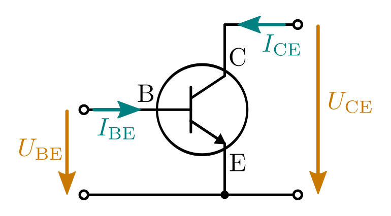
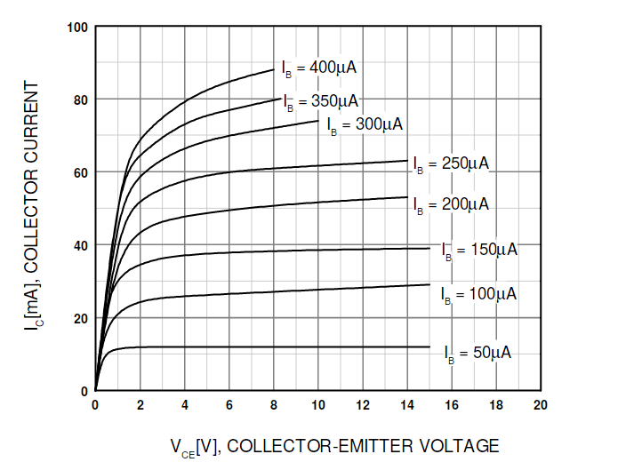
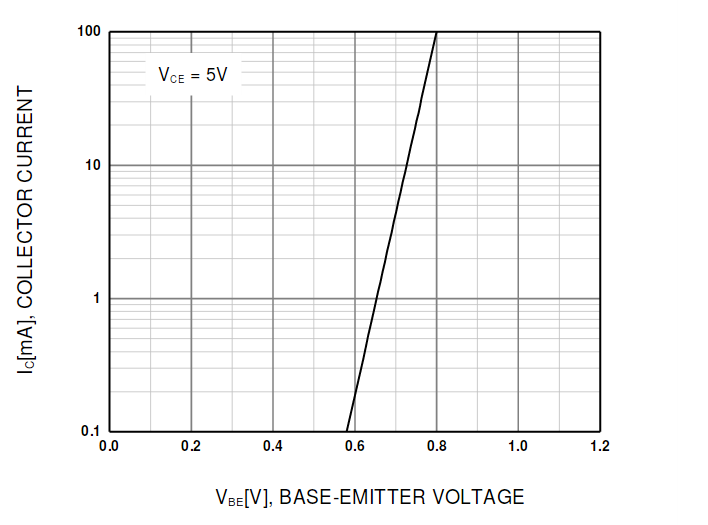

.. index:: Transistor
.. _Transistor:

Transistoren
============

Transistoren sind Halbleiter-Bauteile, die als Schalter, Regler und Verstärker
vielerlei Anwendung finden.

Ein Transistor (Kurzwort für "transfer resistor") kann, je nach Schaltungsart,
tatsächlich wie ein elektrisch regelbarer Widerstand eingesetzt werden.
Grundsätzlich ähnelt ein Transistor allerdings vielmehr einer :ref:`Röhrentriode
<Röhrentriode>`, weshalb er auch als "Halbleiter-Triode" bezeichnet wird.
Transistoren werden insbesondere verwendet, um Ströme zu schalten, zu verstärken
oder zu steuern.

.. index:: Kollektor (Transistor)
.. index:: Emitter (Transistor)
.. _Basis:
.. _Kollektor:
.. _Emitter:

Im Elektronik-Selbstbau werden häufig so genannte "bipolare" Transistoren
eingesetzt. Diese bestehen aus drei Halbleiterschichten, wobei je nach
Reihenfolge der Dotierungen zwischen :math:`npn`- und :math:`pnp`-Transistoren
unterschieden wird. Die drei an den Halbleiterschichten angebrachten Anschlüsse
eines bipolaren Transistors werden Kollektor :math:`\mathrm{C}`, Basis
:math:`\mathrm{B}` und Emitter :math:`\mathrm{E}` genannt. [#]_

.. figure::
    ../pics/bauteile/bauform-transistor-npn.png
    :name: fig-bauformen-transistor-npn
    :alt:  fig-bauformen-transistor-npn
    :align: center
    :width: 33%

    Bauformen von :math:`npn`-Transistoren. Bei :math:`pnp`-Transistoren sind
    :math:`\mathrm{C}` und :math:`\mathrm{E}` vertauscht.

    .. only:: html

        :download:`SVG: Bauformen von npn-Transistoren
        <../pics/bauteile/bauform-transistor-npn.svg>`

Neben den bipolaren Transistoren gibt es auch "unipolare" Feldeffekttransistoren
(FETs), die im Hobby-Bereich meist zum Steuern größerer Stromstärken genutzt
werden. In großen Stückzahlen bilden sie darüber hinaus die wichtigsten
Bestandteile von integrierten Schaltkreisen, beispielsweise
Operationsverstärkern oder Mikroprozessoren.

.. index:: Transistor; npn
.. _npn-Transistor:

npn-Transistoren
----------------

Ein :math:`npn`-Transistor besteht aus drei aufeinander folgenden
Halbleiter-Schichten, wobei die beiden äußeren eine negative und die mittlere
Schicht eine positive Dotierung aufweisen. Der Aufbau entspricht einem doppelten
:ref:`n-p-Übergang <n-p-Übergang>`; nach außen sind die drei Schichten mit
metallischen Anschluss-Kontakten verbunden. [#]_

.. figure::
    ../pics/bauteile/aufbau-transistor-npn.png
    :name: fig-aufbau-transistor-npn
    :alt:  fig-aufbau-transistor-npn
    :align: center
    :width: 60%

    Innerer Aufbau eines :math:`npn`-Transistors (stark vereinfacht).

    .. only:: html

        :download:`SVG: Aufbau npn-Transistor
        <../pics/bauteile/aufbau-transistor-npn.svg>`

Gewöhnlich verläuft der zu steuernde Hauptstrom zwischen dem Kollektor
:math:`\mathrm{C}` und dem Emitter :math:`(\mathrm{E})`. Die Wirkungsweise des
Transistors wird dabei durch die Stromstärke bestimmt, die durch die Basis
:math:`\mathrm{B}` zum Emitter :math:`\mathrm{E}` fließt:

* Fließt durch die Basis :math:`\mathrm{B}` kein Strom, so ist die
  Kollektor-Emitter-Strecke :math:`\mathrm{CE}` des Transistors gesperrt. In
  seiner Wirkung entspricht er dabei einem unendlich großen Widerstand
  beziehungsweise  einem geöffneten Schalter.

* Fließt ein schwacher Strom durch die Basis :math:`\mathrm{B}`, so wird die
  Kollektor-Emitter-Strecke :math:`\mathrm{CE}` leitfähig; es wird also ein
  Vielfaches des Basis-Stroms durch die Kollektor-Emitter-Strecke durchgelassen.
  Je nach Art der Transistor-Schaltung entspricht die Wirkungsweise des
  Transistors einem elektrisch regelbaren Widerstand oder einer leitenden
  Verbindung (fast) ohne Widerstand.

    Schaltzeichen eines :math:`npn`-Transistors.

    .. only:: html

        :download:`SVG: Schaltzeichen npn-Transistor
        <../pics/bauteile/schaltzeichen-transistor-npn.svg>`

Da Transistoren sehr hohe Schaltfrequenzen (rund :math:`\unit[100]{MHz}`,
teilweise sogar noch mehr) zulassen, können beispielsweise auch
niedrig-frequente Spannungsimpulse eines Audio-Eingangs (:math:`\unit[20]{Hz}
\text{ bis } \unit[20]{kHz})` durch Anlegen an die Basis eines Transistors auf
dem erheblich größeren Kollektor-Emitter-Strom abgebildet beziehungsweise
verstärkt werden: [#]_

.. math::
    :label: eqn-transistor-verstaerkung

    I_{\mathrm{CE}} = B \cdot I_{\mathrm{BE}}

Der Verstärkungsfaktor :math:`B` eines einzelnen Transistors liegt, je nach
Bauart, bei rund :math:`100 \text{ bis } 500`; beispielsweise kann bei einem
Transistor mit einem Verstärkungsfaktor von :math:`300` ein Basis-Strom von
:math:`\unit[1]{mA}` einen Kollektor-Emitter-Strom von maximal
:math:`\unit[300]{mA} = \unit[0,3]{A}` steuern.

.. figure:: ../pics/bauteile/diagramm-kennlinie-transistor.png
    :name: fig-diagramm-kennlinie-transistor
    :alt:  fig-diagramm-kennlinie-transistor
    :align: center
    :width: 60%

    Beispiel einer :math:`I_{\mathrm{C}}(I_{\mathrm{B}})`-Kennlinie eines
    Transistors (vereinfacht).

    .. only:: html

        :download:`SVG: Transistor-Kennlinie
        <../pics/bauteile/diagramm-kennlinie-transistor.svg>`

Ist der durch die Basis fließende Strom groß genug, so ist der Transistor "in
Sättigung" -- zwischen Kollektor und Emitter fließt entsprechend der maximal
mögliche (durch die restliche Schaltung vorgegebene) Strom; eine Verstärkung des
Basis-Stroms führt zu keiner weiteren Erhöhung des Kollektor-Emitter-Stroms. Der
Transistor wirkt bei Anlegen derartiger Basis-Spannungen vielmehr wie ein
Schalter.

.. Um das Verhalten eines Transistors in einer Schaltung planen zu können, benötigt
.. man möglichst genaue Daten. Wichtig ist z.B. der Stromverstärkungsfaktor, der
.. maximal erlaubte Kollektorstrom, die maximale Kollektor-Emitterspannung und die
.. maximale Verlustleistung.

.. Verstärker-Röhren haben einen weicheren Übergang in den
..  Sättigungsbereich, was zu Verzerrungen mit weniger Obertönen führt.

.. index:: Transistor; pnp
.. _pnp-Transistoren:

pnp-Transistoren
----------------

Ein :math:`pnp`-Transistor besteht ebenfalls aus drei aufeinander folgenden
Halbleiter-Schichten, wobei die beiden äußeren eine positive und die mittlere
Schicht eine negative Dotierung aufweisen.

    Schaltzeichen eines :math:`pnp`-Transistors.

    .. only:: html

        :download:`SVG: Schaltzeichen pnp-Transistor
        <../pics/bauteile/schaltzeichen-transistor-pnp.svg>`

Da die Schichten eines :math:`pnp`-Transistors im Vergleich zu einem
:math:`npn`-Transistor eine genau umgekehrte Dotierung aufweisen, müssen auch
die Ströme in die entgegengesetzte Richtung fließen. Im Schaltzeichen ist dies
dadurch gekennzeichnet, dass der Pfeil nicht von der Basis weg, sondern zur
Basis hin zeigt.

Hierzu gibt es folgende Merksprüche:

* :math:`npn`-Transistor:
    | "NPN means 'Not Pointing iN'", oder
    | "Naus, Pfeil 'Naus!"
* :math:`pnp`-Transistor:
    | "PNP heißt 'Pfeil Nach Platte'", oder
    | "Tut der Pfeil der Basis weh, handelt sich's um PNP"

Entsprechend sind auch der Kollektor- und der Emitter-Anschluss eines
:math:`pnp`-Transistors im Vergleich zu einem :math:`npn`-Transistor vertauscht.
Die Besonderheit von :math:`pnp`-Transistoren gegenüber :math:`npn`-Transistoren
liegt darin, dass man zum Freischalten der Kollektor-Emitter-Strecke keinen
Stromfluss in die Basis hinein (und aus dem Emitter hinaus) verursachen muss,
sondern vielmehr einen Stromfluss (vom Emitter kommend) aus der Basis *heraus*
zulassen muss.

.. _Ströme und Spannungen bei bipolaren Transistoren:

Ströme und Spannungen bei bipolaren Transistoren
------------------------------------------------

In der folgenden Abbildung sind die für einen Transistor relevanten Ströme und
Spannungen explizit für die üblichere Transistor-Variante, nämlich einen
:math:`npn`-Transistor eingezeichnet: [#]_

    Ströme und Spannungen bei einem :math:`npn`-Transistor

    .. only:: html

        :download:`SVG: npn-Transistor (Ströme und Spannungen)
        <../pics/bauteile/npn-transistor-stroeme-und-spannungen.svg>`

Für die Spannung :math:`U_{\mathrm{BE}}` zwischen Basis und Kollektor und der
Basis-Stromstärke :math:`I_{\mathrm{BE}}` gilt im Wesentlichen die gleiche
Beziehung wie zwischen zwischen Spannung und Strom an einer :ref:`Diode
<Diode>`. Ab einem bestimmten Grenzwert (bei normalen Transistoren rund
:math:`\unit[0,6]{V}`) steigt die Basis-Stromstärke :math:`I_{\mathrm{BE}}` mit
einer zunehmenden Spannung :math:`U_{\mathrm{BE}}` sehr schnell an. Um einen
Transistor steuern zu können, muss also die Basis-Stromstärke gezielt begrenzt
werden. [#]_

.. _Stromstärken bei einem npn-Transistor:

.. rubric:: Stromstärken bei einem :math:`npn`-Transistor

Für den Zusammenhang zwischen den Stromstärken :math:`I_{\mathrm{BE}}` und
:math:`I_{\mathrm{CE}}` ist es für viele Anwendungen ausreichend, einen
konstanten Verstärkungsfaktor :math:`B =
\frac{I_{\mathrm{CE}}}{I_{\mathrm{BE}}}` anzunehmen; dieser Wert kann
üblicherweise dem Datenblatt des Transistors entnommen werden. Ein
Verstärkungsfaktor von :math:`B=100` bedeutet beispielsweise, dass ein
Basis-Strom von mit einer Stärke von :math:`I_{\mathrm{BE}} = \unit[1]{mA}`
einen Kollektor-Emitter-Strom :math:`I_{\mathrm{CE}} = \unit[100]{mA}` zur Folge
hat. Was passiert nun allerdings, wenn bei einer ansonsten unveränderten
Schaltung plötzlich der Anschluss des Kollektors gekappt wird? Es können dann
nicht mehr :math:`\unit[100]{mA}` in den Kollektor hinein fließen.

.. Block 31 8:35

Man kann feststellen, dass sich in diesem Fall auch die Stromstärke durch die
Basis verändert: Die Basis-Emitter-Strecke und die Kollektor-Emitter-Strecke
bilden gewissermaßen eine gemeinsame Diode, allerdings mit einem festem
Stromteiler. Wird die eine Seite des Stromteilers nicht mit Strom versorgt, so
muss der gesamte Strom durch die andere Seite fließen. Bei einer ansonsten
unveränderten Schaltung fließen somit nicht mehr :math:`\unit[1]{mA}` durch die
Basis, sondern plötzlich :math:`\unit[(100+1)]{mA}`. Der Verstärkungsfaktor
:math:`B` beschreibt somit vielmehr den auftretenden Emitterstrom, der sich
gewöhnlich so aufteilt, dass nur :math:`\tfrac{1}{100}` von der Basis bezogen
wird, und der restliche Strom vom Kollektor kommt (solange dort Strom zur
Verfügung steht).

.. _Spannungen bei einem npn-Transistor:

.. rubric:: Spannungen bei einem :math:`npn`-Transistor

Der Wert der Spannung :math:`U_{\mathrm{CE}}` entlang der
Kollektor-Emitter-Strecke hängt von der Verwendungsweise des Transistors ab.

.. Block 31 14:35

* Wird der Transistor als Schalter verwendet, so ist dessen Widerstand bei einem
  fehlenden Basis-Strom unendlich groß; an der :math:`\mathrm{CE}`-Strecke des
  Transistors fällt somit die komplette von außen anliegende Spannung ab --
  solange der Transistor nicht "durchbricht", was je nach Transistor-Typ ab
  Spannungen von etwa :math:`\unit[50]{V}` der Fall sein kann.

  Wird der Transistor durch einen ausreichend hohen Basis-Strom hingegen voll
  durchgeschaltet, so würde bei einem idealen Transistor entlang der
  :math:`\mathrm{CE}`-Strecke überhaupt keine Spannung abfallen. In der Praxis stellt man
  bei realen Transistoren allerdings einen Spannungsabfall von *minimal*
  :math:`\unit[0,2]{V}` fest.

* Allgemein hängt der Spannungsabfall an der :math:`\mathrm{CE}`-Strecke von der äußeren
  Schaltung ab. Dies kann man anhand der folgenden (idealisierten) Schaltung
  erkennen:

  .. figure:: ../pics/schaltungen/transistor-spannungsabfall-ce-strecke.png
      :name: fig-transistor-spannungsabfall-ce-strecke
      :alt:  fig-transistor-spannungsabfall-ce-strecke
      :align: center
      :width: 50%

      Spannungsabfall entlang der :math:`\mathrm{CE}`-Strecke bei einem Transistor.

      .. only:: html

          :download:`SVG: Spannungsabfall CE-Strecke (Transistor)
          <../pics/schaltungen/transistor-spannungsabfall-ce-strecke.svg>`

  Der Spannungsabfall entlang der :math:`\mathrm{CE}`-Strecke wird sowohl durch
  :math:`U_0` als auch durch :math:`R_1` beeinflusst. Am Widerstand :math:`R_1`
  fällt nämlich die Spannung :math:`U_1 = R_1 \cdot I_{\mathrm{CE}}` ab. Die an
  der :math:`\mathrm{CE}`-Strecke des Transistors abfallende Spannung beträgt
  demnach :math:`U_0 - U_1 = U_0 - R_1 \cdot I_{\mathrm{CE}}`. Ist
  beispielsweise :math:`U_0 = \unit[10]{V}` und :math:`R_1=\unit[10]{\Omega}`,
  so ergibt sich am Widerstand ein Spannungsabfall von :math:`U_1 = R_1 \cdot
  I_{\mathrm{CE}} = \unit[1]{V}` und entsprechend ein Spannungsabfall an der
  :math:`\mathrm{CE}`-Strecke von :math:`U_{\mathrm{CE}} = \unit[9]{V}`.

Ein bipolarer Transistor sollte also, wie das obige Beispiel zeigt, weniger als
ein variabler Widerstand als vielmehr als eine regelbare Stromquelle aufgefasst
werden: Während bei einem Potentiometer der Widerstand :math:`R` (also das
Verhältnis :math:`\frac{U}{I}` aus der anliegenden Spannung und der
resultierenden Stromstärke) reguliert werden kann, kann bei einem bipolaren
Transistor ausschließlich die Stromstärke :math:`I_{\mathrm{CE}}` aktiv geregelt
werden; die entsprechende Spannung entlang der :math:`\mathrm{CE}`-Strecke
stellt der Transistor automatisch ein.

.. _Bauteil-Schwankungen:

.. rubric:: Bauteil-Schwankungen

Bei einem bipolaren Transistor wird, wie im letzten Abschnitt beschrieben, ein
Last-Strom :math:`I_{\mathrm{CE}}` mittels eines Steuer-Stroms
:math:`I_{\mathrm{BE}}`  gesteuert. Der Verstärkungsfaktor :math:`B`, der das
Verhältnis dieser beiden Ströme angibt, weist allerdings auch bei gleichen
Transistor-Typen von Bauteil zu Bauteil teilweise erhebliche Unterschiede auf.

Mittels (meist billigeren) Multimetern lässt sich der Verstärkungsfaktor
:math:`B` eines Transistors einfach bestimmen, da diese über eine entsprechende
eingebaute Funktion verfügen. In der Praxis wird diese Funktion nämlich nicht
oft verwendet, beispielsweise weil der Verstärkungsfaktor :math:`B` stark
frequenzabhängig ist (Transistoren verstärken bei niedrigen Frequenzen meist
bessr als bei höheren). Um einen Transistor zu charakterisieren, genügt daher
ein einzelner Zahlenwert nicht. Da eine derartige Mess-Schaltung aber recht
simpel ist, lässt sich eine Verstärkungs-Mess-Funktion (oft auch als
``h_{\mathrm{FE}}`` bezeichnet) gut als Zusatz-Feature vermarkten.

Den in Europa häufig als Standard verwendeten BC547-Transistor gibt
beispielsweise in drei Verstärker-Klassen: :math:`\mathrm{A}`,
:math:`\mathrm{B}` und :math:`\mathrm{C}`. Aus einem `Datenblatt
<http://pdf.datasheetcatalog.net/datasheet/fairchild/BC547.pdf>`__ kann man für
den BC547-Transistor damit folgende Werte-Bereiche für den Verstärkungsfaktor
:math:`B` entnehmen:

* ``BC547A``: :math:`110 \le B \le 220`
* ``BC547B``: :math:`200 \le B \le 450`
* ``BC547C``: :math:`420 \le B \le 800`

Da der konkrete Wert :math:`B` des Stromverstärkungsfaktors variieren kann,
sollten Transistor-Schaltungen möglichst so konzipiert sein, dass sie bezüglich
Abweichungen dieses Parameters unempfindlich sind.

.. _Kennlinien-Felder von Transistoren:

.. rubric:: Kennlinien-Felder von Transistoren

Um das Verhalten eines Transistors in einer Schaltung planen zu können, sollte
man einen groben Wert für den Stromverstärkungsfaktor :math:`B`, den maximal
erlaubten Kollektorstrom :math:`I_{\mathrm{CE}}`, die maximale
Kollektor-Emitterspannung :math:`U_{\mathrm{CE}}` sowie die maximale
Verlustleistung :math:`P` kennen.

Möchte man einen Transistor allerdings nicht als Schalter, sondern als
Verstärker betreiben, so genügen einzelne Werte oft nicht zur Charakterisierung
eines Transistors. Weitaus nützlicher sind sogenannte "Kennlinienfelder", in
denen der Kollektor-Strom :math:`I_{\mathrm{CE}}` als Funktion der
Kollektor-Spannung :math:`U_{\mathrm{CE}}` angegeben wird. Dieser Zusammenhang
ist abhängig von der Stromstärke :math:`I_{\mathrm{BE}}` durch die Basis des
Transistors, so dass es in einem Kennlinienfeld nicht nur eine, sondern mehrere
Kennlinien gibt.

    Kennlinienfeld eines ``BC547``-Transistors (Quelle: `Datasheetcatalog
    <http://pdf.datasheetcatalog.net/datasheet/fairchild/BC547.pdf>`__):
    Kollektor-Emitter-Strom :math:`I_{\mathrm{CE}}` als Funktion von
    :math:`U_{\mathrm{CE}}`.

Alle Kennlinien haben (unabhängig vom Basis-Strom :math:`I_{\mathrm{BE}}`)
gemeinsam, dass der Strom :math:`I_{\mathrm{CE}}` gleich Null ist, wenn keine
Spannung :math:`U_{\mathrm{CE}}` zwischen dem Kollektor und dem Emitter anliegt.
Je größer die Spannung :math:`U_{\mathrm{CE}}` wird, desto größer wird auch der
Strom :math:`I_{\mathrm{CE}}` durch den Transistor. Der Wert von
:math:`I_{\mathrm{CE}}` ist allerdings nach oben hin begrenzt, da schließlich
eine Sättigung eintritt -- dies ist gleichbedeutend damit, dass der Transistor
voll durchschaltet. [#]_

Eine zweite wichtige Kennlinie gibt den Kollektor-Emitter-Strom
:math:`I_{\mathrm{CE}}` in Abhängigkeit von der Basis-Emitter-Spannung
:math:`U_{\mathrm{BE}}` an. Hierfür wird für :math:`I_{\mathrm{CE}}` meist eine
logarithmische Skalierung gewählt. Die Gerade, die sich in einem solchen
Diagramm ergibt, entspricht einer (logarithmisch skalierten) Dioden-Kennlinie.

    Kollektor-Emitter-Strom :math:`I_{\mathrm{CE}}` als Funktion der
    Basis-Spannung :math:`U_{\mathrm{BE}}` bei einem ``BC547``-Transistor
    (Quelle: `Datasheetcatalog
    <http://pdf.datasheetcatalog.net/datasheet/fairchild/BC547.pdf>`__)

Mittels einer solchen Kennlinie kann abgeschätzt werden, welcher
:math:`\mathrm{CE}`-Strom bei einer bestimmten an der Basis anliegenden Spannung
auftritt. Ebenso kann man mit Hilfe dieses Diagramms ungefähr abschätzen, wie
groß der Basis-Strom :math:`I_{\mathrm{BE}}` bei einer bestimmten Basis-Spannung
:math:`U_{\mathrm{BE}}` ist, indem man den Kollektor-Strom
:math:`I_{\mathrm{CE}}` durch den (ebenfalls geschätzten)
Stromverstärkungsfaktor des Transistors dividiert.

Wirklich exakte Werte darf man nicht erwarten, wenn man sich an den Kennlinien
eines Transistors orientiert; dies wäre auch kaum sinnvoll, da die einzelnen
Exemplare eines Transistor-Typs, wie im letzten Abschnitt beschrieben,
erhebliche Schwankungen aufweisen können.

.. Aufgabe Skript S.52: Bei 0,77 V nach rechtem Diagramm ca. 40 mA
.. Dann im linken Bild Punkt bei 5V 40 mA suchen und im Diagramm weiter nach
.. rechts (bis auf 12V) rutschen/interpolieren für grobe Abschätzung -- ergibt
.. ca. 45 mA

.. oftmals Schaltungs-Simulatoren praktischer
.. aber auch dort Interpretation nötig! insbesondere wenn simulator genauigkeit
.. vorgaukelt

.. Schwankungen müssen anderweitig kompensiert werden, beispielsweise mit Hilfe von Rückkopplungen

.. Coole Erklärung bei Block 31 22:45
.. Coole Erklärung bei Block 31 49:20: Warum's nicht sinnvoll ist
.. den Widerstand im Beispiel anders zu platzieren

.. Zwei Transistoren in einem Gehäuse für gleiche Verstärkungsfaktoren /
.. Stromspiegel

.. \beta : Wechselstrom-Verstärkung
.. b nimmt meist mit zunehmenden Frequenzen ab.

.. mit FETs sind weit weniger als 0,2V min-spannungsabfall möglich
.. FETs viel eher steuerbare Widerstände (mittels Spannung regelbar)

.. Feldeffekt-Transistoren verhalten sich viel eher wie regelbare Widerstände:
.. Aus der Steuer*spannung* resultiert ein großer oder kleiner Widerstand.

..  Noch höhere Basis-Spannungen werden folglich nicht weiter verstärkt, sondern
..  vielmehr obertonreich "abgeschnitten", z.B. wenn eine Mikrofon-Aufnahme
..  "übersteuert" wird.

.. entscheidende Details für die Auswahl eines Transistors: Wie verhält er sich
.. bei ganz kleinen, wie bei ganz großen Strömen, und wie bei hohen Frequenzen?

..  Foto-Transistor und Opto-Koppler
..  --------------------------------

.. raw:: html

    

.. only:: html

    .. rubric:: Anmerkungen:

.. [#] Im Englischen wird die Basis in Anlehnung an das Gitter einer
    Röhrentriode als "gate" bezeichnet.

.. [#] Die schematische Darstellung in der Abbildung :ref:`Innerer Aufbau eines
    npn-Transistors <fig-aufbau-transistor-npn>` ist insofern stark vereinfacht
    dargestellt, als dass ein :math:`npn`-Transistor in der Realität nicht
    symmetrisch ist: Die Halbleiterschicht zwischen Kollektor und Basis ist
    wesentlich dünner als als diejenige zwischen der Basis und dem
    Emitter-Ausgang; zudem sind die einzelnen Bereiche in reellen Transistoren
    anders angeordnet und unterscheiden sich in ihren Dotierungen. Letztlich
    kann nur der Basis-Emitter-Übergang als "echte" Diode angesehen werden, wenn
    auch mit einer nur geringen Durchbruchspannung.

    Dies ist insofern von Bedeutung, als dass man einen :math:`npn`-Transistor
    nicht "umgekehrt", also mit Stromflüssen von der Basis beziehungsweise vom
    Emitter zum Kollektor hin betreiben sollte. Dies ist zwar prinzipiell
    möglich, allerdings verhält sich der Transistor so nur wie ein sehr
    schlechter Transistor mit einem sehr geringen Verstärkungsfaktor und einem
    sehr starken Rauschen.

    Der doppelte :math:`n-p`-Übergang lässt sich auch nicht mittels zweier
    Dioden nachbauen. Eine (ebenfalls vereinfachte) Vorstellung ist vielmehr,
    dass die sehr dünne mittlere Schicht mittels eines Stromflusses durch die
    Basis mit freien Ladungsträgern "geflutet" werden kann und der Transistor
    somit insgesamt leitfähig wird.

.. [#] In Wirklichkeit ist der Verstärkungs-Faktor nicht konstant, sondern
    beispielsweise von der Frequenz des an der Basis anliegenden Eingang-Signals
    abhängig. Für einfache Anwendungen ist die Annahme eine konstanten
    Verstärkungsfaktors jedoch ausreichend.

.. [#] Auf die Begrenzung des Basis-Stroms sollte gut geachtet werden, da zu
    hohe Basis-Ströme die Lebenszeit eines Transistors erheblich verkürzen.
    Transistoren werden zudem oftmals nicht schlagartig zerstört, sondern
    verändern bei Überlastung zunehmend ihre Bauteil-Parameter, so dass sie sich
    im Lauf der Zeit immer weniger wie ein "normaler" Transistor verhalten.
    Derartige Fehler sind in der Praxis oftmals nur schwer zu finden.

.. [#] Bisweilen werden die Ströme :math:`I_{\mathrm{BE}}` und
    :math:`I_{\mathrm{CE}}` auch kurz mit :math:`I_{\mathrm{B}}` beziehungsweise
    :math:`I_{\mathrm{C}}` bezeichnet, da beide Ströme ohnehin stets beim Emitter
    abfließen.

.. [#] Eine einfache Möglichkeit die Basis-Stromstärke zu begrenzen ist -- wie
    bei :ref:`LEDs <LED mit Vorwiderstand>` -- die Verwendung eines
    Vorwiderstands. Hat man beispielsweise eine Spannung von
    :math:`U=\unit[10]{V}` anliegen und möchte den Basis-Strom auf maximal
    maximal :math:`I_{\mathrm{BE}} = \unit[10]{mA}` begrenzen, so wäre dafür ein
    Vorwiderstand mit einem Wert von :math:`R = \tfrac{U}{I_{\mathrm{B}}} =
    \unit[1]{k \Omega}` geeignet. [#]_

.. [#] Hat man einen anderen Basis-Strom :math:`I_{\mathrm{BE}}` als im
    Kennlinienfeld angegeben ist, so kann man dennoch die dazugehörige Linie
    anhand der übrigen Linien mittels Interpolation abschätzen.

    Aus dem flachen Berech des Kennlinienfelds kann auch in grober Näherung der
    Stromverstärkungs-Faktor des Transistors abgelesen werden; die Vorstellung
    eines einzelnen solchen Werts gilt schließlich in erster Linie für den Fall,
    dass der Transistor voll durchschaltet.

.. hint::

    Transistoren werden in diesem Tutorial unter anderem in den Abschnitten
    :ref:`Transistor-Grundschaltungen <Transistor-Grundschaltungen>` und
    :ref:`Kipp-Schaltungen <Kipp-Schaltungen>` verwendet.

