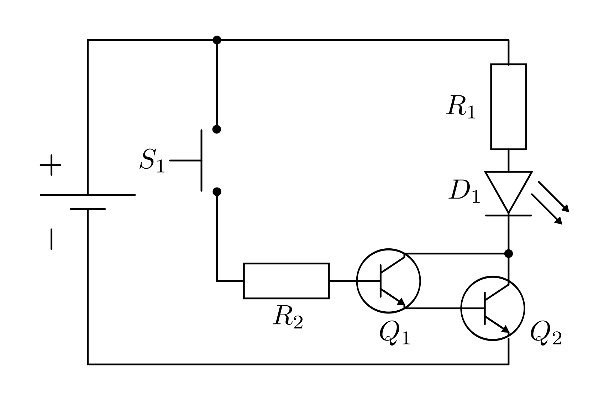

.. _Grundschaltungen:

Grundschaltungen
================

Die folgenden Schaltungen dienen dem Kennenlernen der einzelnen Bauteile und
ihrer Grundfunktionen. Die Schaltungen im folgenden Abschnitt sind stets auf
eine :math:`\unit[9]{V}`- Gleichspannung ausgelegt. Eine solche Spannung kann
beispielsweise mittels eines regelbaren Labornetzteils, einer Blockbatterie,
oder näherungsweise auch durch einen wiederaufladbaren und daher
umweltfreundlicheren Block-Akku bereitgestellt werden.

.. index:: Spannungsteiler
.. _Spannungsteiler:

Spannungsteiler
---------------

Als Spannungsteiler bezeichnet man Schaltungen aus zwei oder mehr Widerständen,
mit dem Ziel, eine anliegende Spannung gezielt in bestimmte Verhältnisse
aufzuteilen.

.. index:: Spannungsteiler; unbelastet
.. _Unbelastete Spannungsteiler:

Unbelastete Spannungsteiler
^^^^^^^^^^^^^^^^^^^^^^^^^^^

Eine sehr einfache, aber dennoch wichtige Grundschaltung besteht aus einer
:ref:`Reihenschaltung zweier Widerstände <Reihen- und Parallelschaltung von
Widerständen>`:

    Aufbau eines unbelasteten Spannungsteilers.

    .. only:: html

        :download:`SVG: Spannungsteiler (unbelastet)
        <../pics/schaltungen/spannungsteiler-unbelastet.svg>`

Eine solche Anordnung wird als "unbelasteter Spannungsteiler" bezeichnet. Da es
sich um eine Reihenschaltung handelt, ist die Stromstärke :math:`I` innerhalb
der Schaltung an allen Stellen gleich, während die Teilspannungen :math:`U_1`
und :math:`U_2` an den Widerständen :math:`R_1` und :math:`R_2` in Summe gleich
der anliegenden Gesamtspannung :math:`U_{\mathrm{ges}}` sind:

.. math::

    I_{\mathrm{ges}} = I_1 = I_2 \\[6pt]
    U_{\mathrm{ges}} = U_1 + U_2

Aus den beiden obigen Formeln sowie dem :ref:`Ohmschen Gesetz <gwp:Ohmsches
Gesetz>` :math:`U=R \cdot I` kann beispielsweise eine Formel zur Berechnung von
:math:`U_1` in Abhängigkeit von der Gesamtspannung :math:`U_{\mathrm{ges}}` und
den beiden Widerständen :math:`R_1` und :math:`R_2` angegeben werden. Setzt man
in die zweite Gleichung :math:`I = \frac{U}{R}` ein, so erhält man:

.. math::

    \frac{U_1}{R_1} = \frac{U_{\mathrm{ges}}}{R_{\mathrm{ges}}}

Diese Gleichung kann unmittelbar nach :math:`U_1` aufgelöst werden. Setzt man
für zudem :math:`R_{\mathrm{ges}} = R_1 + R_2` ein (Reihenschaltung!), so erhält
man schließlich:

.. math::
    :label: eqn-unbelasteter-spannungsteiler-u1

    U_1 = \frac{R_1}{R_{\mathrm{ges}}} \cdot U_{\mathrm{ges}} = \frac{R_1}{R_1 +
    R_2} \cdot U_{\mathrm{Ges}}

Am ersten Widerstand fällt somit der Anteil :math:`\frac{R_1}{R_{\mathrm{ges}} }`
der Gesamtspannung ab. In gleicher Weise kann gezeigt werden, dass am zweiten
Widerstand die Spannung :math:`\frac{R_2}{R_{\mathrm{ges}} }` abfällt:

.. math::
    :label: eqn-unbelasteter-spannungsteiler-u2

    U_2 = \frac{R_2}{R_{\mathrm{ges}}} \cdot U_{\mathrm{ges}} = \frac{R_2}{R_1 +
    R_2} \cdot U_{\mathrm{Ges}}

Die zwei Spannungen :math:`U_1` und :math:`U_2` an den beiden Widerständen
stehen also zueinander im gleichen Werte-Verhältnis wie die Widerstände selbst.

*Beispiel:*

* Ein Stromkreis, der als Spannungsquelle eine :math:`\unit[9]{V}`-Batterie hat,
  besteht aus den zwei Widerständen :math:`R_1 = \unit[10]{\Omega}`  und
  :math:`R_2 = \unit[90]{\Omega}`. Wie groß sind die Spannungen :math:`U_1` und
  :math:`U_2`, die an :math:`R_1` beziehungsweise :math:`R_2` anliegen?

  Der Gesamtwiderstand der Schaltung beträgt :math:`R_{\mathrm{ges}} = R_1 + R_2
  = \unit[100]{\Omega}`. Am den Widerständen liegen damit folgende Spannungen an:

  .. math::

      U_1 &= \frac{R_1}{R_{\mathrm{ges}}} \cdot U_{\mathrm{ges}}=
      \frac{\unit[10]{\Omega}}{\unit[100]{\Omega}} \cdot \unit[9]{V} =
      \unit[0,9]{V} \\[4pt]
      U_2 &= \frac{R_2}{R_{\mathrm{ges}}} \cdot U_{\mathrm{ges}}=
      \frac{\unit[90]{\Omega}}{\unit[100]{\Omega}} \cdot \unit[9]{V} =
      \unit[8,1]{V}

  Das gleiche Spannungsverhältnis stellt sich ein, wenn man als Widerstandswerte
  beispielsweise :math:`R_1=\unit[100]{\Omega}` und :math:`R_2 =
  \unit[900]{\Omega}` wählt; in diesem Fall ist lediglich die Stromstärke in der
  Schaltung um ein :math:`10`-faches geringer. Die Spannungen hängen hingegen
  nicht von den konkreten Werten der Widerständen, sondern nur von ihrem
  Größenverhältnis ab.

.. index:: Spannungsteiler; belastet
.. _Belastete Spannungsteiler:

Belastete Spannungsteiler
^^^^^^^^^^^^^^^^^^^^^^^^^

Bei einer :ref:`Parallelschaltung zweier Widerstände <Parallelschaltung von
Widerständen>` ist die an beiden Widerständen anliegende Spannung gleich; zudem
hat sich im letzten Abschnitt gezeigt, dass man mittels eines Spannungsteilers
die anliegende Gesamtspannung in beliebig große Teilspannungen aufteilen kann.
Könnte man also nicht durch ein Parallelschalten eines Spannungsteilers zu einem
Verbraucher-Widerstand :math:`R_{\mathrm{V}}` auch dort eine gewünschte
(geringere) Teilspannung erhalten?

    Aufbau eines belasteten Spannungsteilers.

    .. only:: html

        :download:`SVG: Spannungsteiler (belastet)
        <../pics/schaltungen/spannungsteiler-belastet.svg>`

Die Antwort ist ein klares "Jain", da sich beispielsweise durch das
Parallelschalten von :math:`R_{\mathrm{V}}` zum Widerstand :math:`R_2` des
Spannungsteilers ein neuer Widerstandswert :math:`R_2^{*}` ergibt.
Für die Parallelschaltung dieser zwei Widerstände gilt nämlich: [#]_

.. math::
    :label: eqn-widerstand-parallelschaltung-zweier-widerstaende

    \frac{1}{R_2^{*}} = \frac{1}{R_2} + \frac{1}{R_{\mathrm{V}}} \quad
    \Longleftrightarrow \quad R_2^{*} = \frac{R_2 \cdot R_{\mathrm{V}}}{R_2 +
    R_{\mathrm{V}}}

* Ist :math:`R_{\mathrm{V}}` gegenüber :math:`R_2` vergleichsweise groß, so ist
  der Wert von :math:`\frac{1}{R_{\mathrm{V}}}` vergleichsweise gering, und es
  ergibt sich :math:`R_2^{*} \approx R_2`. Die am Verbraucher
  anliegende Spannung entspricht in diesem Fall also in guter Näherung der am
  Widerstand :math:`R_2` des unbelasteten Spannungsteilers anliegenden Spannung
  :math:`U_2`.

* Je geringer der Wert von :math:`R_{\mathrm{V}}` im Vergleich zum Wert von
  :math:`R_2` wird, desto geringer wird auch der Wert von :math:`R_2^{*}`. Die
  nun am Widerstand :math:`R_2` des belasteten Spannungsteilers anliegende
  Spannung :math:`U_2^{*}` und damit auch die am Verbraucher anliegende Spannung
  sinkt folglich gegenüber der Spannung :math:`U_2` beim unbelasteten
  Spannungsteiler ab.

Für die Spannung :math:`U_{\mathrm{2}}` am belasteten Spannungsteiler gilt also:

.. math::
    :label: eqn-belasteter-spannungsteiler

    U_2 = \frac{R_2^{*}}{R_1 + R_2^{*}} \cdot U_{\mathrm{ges}}

Um einer starken Änderung von :math:`U_2` entgegenzuwirken, muss man bei einen
einen niederohmigen Spannungsteiler einsetzen; damit erhöht sich allerdings auch
der ungenutzte "Querstrom" durch den Widerstand :math:`R_2`.

.. _LED mit Vorwiderstand:
.. _Leuchtdiode mit Vorwiderstand:

Leuchtdiode mit Vorwiderstand
^^^^^^^^^^^^^^^^^^^^^^^^^^^^^

:ref:`Leuchtdioden <Leuchtdiode>` ("LEDs") werden beim Experimentieren gerne
eingesetzt, um auf den ersten Blick zu erkennen, ob an einer bestimmten Stelle
Strom fließt oder nicht. Damit beispielsweise eine rote Leuchtdiode mit
"normaler" Helligkeit aufleuchtet, benötigt sie eine Gleichspannung von etwa
:math:`U = \unit[1,9]{V}`.

Da zu hohe Spannungen (:math:`U > \unit[2,5]{V}`) das Bauteil zum Überhitzen
bringen können, schaltet man vor eine Leuchtdiode :math:`D` bei Bedarf stets
einen so genannten Vorwiderstand :math:`R` in Reihe. Damit hat man letztlich
einen Spannungsteiler mit einem Widerstand und einer Diode gebaut, was zur Folge
hat, dass an der LED nur noch ein Teil der Gesamt-Spannung anliegt.

.. figure::
    ../pics/schaltungen/led-mit-vorwiderstand.png
    :name:  fig-led-mit-vorwiderstand
    :alt:   fig-led-mit-vorwiderstand
    :align: center
    :width: 40%

    Schaltung einer LED mit Vorwiderstand.

    .. only:: html

        :download:`SVG: LED mit Vorwiderstand
        <../pics/schaltungen/led-mit-vorwiderstand.svg>`

Bei einer Versorgungsspannung von :math:`U = \unit[9]{V}` muss am Vorwiderstand
eine Spannung von :math:`U_{\mathrm{R}} = \unit[7,1]{V}` abfallen, um eine
typische Betriebsspannung von :math:`U_{\mathrm{LED}} = \unit[1,9]{V}` an der
Leuchtdiode zu erreichen. Beträgt der Wert des Vorwiderstandes beispielsweise
:math:`R = \unit[470]{\Omega }`, so ergibt sich nach dem :ref:`Ohmschen Gesetz
<gwp:Ohmsches Gesetz>` für die Schaltung folgende Stromstärke:

.. math::

    I = \frac{U_{\mathrm{R}}}{R} = \frac{\unit[7,1]{V}}{\unit[470]{\Omega }}
    \approx \unit[0,015]{A} = \unit[15]{mA}

Diese Stromstärke fließt, da der Vorwiderstand und die Leuchtdiode als
Reihenschaltung vorliegen, auch durch die LED. Normale LEDs werden üblicherweise
mit Stromstärken von knapp :math:`\unit[20]{mA}` betrieben, so dass ein
:math:`\unit[470]{\Omega}`-Widerstand bei einer anliegenden Spannung von
:math:`\unit[9]{V}` keine schlechte Wahl ist.

*Beispiel:*

* Wie groß müsste der Vorwiderstand einer LED allerdings exakt sein, wenn an
  dort bei einer anliegenden Spannung von :math:`\unit[1,9]{V}` die Stromstärke
  :math:`\unit[20]{mA}` betragen soll?

  Die LED wird ab :math:`\unit[1,9]{V}` leitfähig; bei nur geringfügig höheren
  Spannungen steigt die Stromstärke gemäß der gewöhnlichen Diodenkennlinie sehr
  schnell an. Man kann folglich damit rechnen, dass der Spannungsabfall an der LED
  *immer* rund :math:`\unit[1,9]{V}` beträgt, unabhängig von der Stromstärke. Am
  Vorwiderstand muss somit bei einer anliegenden Gesamtspannung von
  :math:`\unit[9]{V}` eine Teilspannung von :math:`U_1=\unit[7,1]{V}` abfallen.

  Da zudem die Stromstärke im Vorwiderstand :math:`I_1 = I_{\mathrm{ges}} =
  \unit[20]{mA}` betragen soll, kann der Wert :math:`R_1` des Vorwiderstands
  gemäß dem Ohmschen Gesetz berechnet werden:

  .. math::

      R_1 = \frac{U_1}{I_1} = \frac{\unit[7,1]{V}}{\unit[0,02]{A}} \approx
      \unit[355]{\Omega}

  Hat man einen solchen Widerstand nicht als Bauteil vorliegen, so kann man
  entweder den nächst größeren wählen, oder einen regelbaren Widerstand (ein
  Potentiometer) verwenden.

Man kann in Schaltung :ref:`LED mit Vorwiderstand <fig-led-mit-vorwiderstand>`
den Taster :math:`S_1` auch durch zwei offene Leiter-Enden ersetzen, um einen
"Durchgangsprüfer" zu erhalten. Hält man diese an die Kontaktstellen eines
anderen leitenden Bauteils, beispielsweise an eine andere Leuchtdiode, einen
(nicht zu großen) Widerstand oder an eine kleine Glühbirne, so leuchtet die
Leuchtdiode :math:`D_1` auf, sofern das Bauteil intakt ist. Bei zu großen
Widerständen oder unterbrochenen Kontaktstellen -- beispielsweise einem intakten
Kondensator oder einer durchgebrannten Sicherung -- bleibt :math:`D_1` hingegen
dunkel.

.. _Spannungsregelung mit Z-Dioden:

Spannungsregelung mit Z-Dioden
^^^^^^^^^^^^^^^^^^^^^^^^^^^^^^

Solange die Quellspannung :math:`U_0` unterhalb der Durchbruchspannung der
Zenerdiode :math:`D_1` bleibt, liegt zwischen den Anschlüssen :math:`B_1` und
:math:`B_2` ebenfalls die Spannung :math:`U_0` an. Steigt :math:`U_0` hingegen
über die Durchbruchspannung von :math:`D_1`, so bleibt die Spannung zwischen
:math:`B_1`  und :math:`B_2` beim Wert der Durchbruchspannung von :math:`D_1`;
die restliche Spannung fällt am Widerstand :math:`R_1` ab.

    Grundschaltung einer Z-Diode.

    .. only:: html

        :download:`SVG: Grundschaltung Z-Diode
        <../pics/schaltungen/grundschaltung-zenerdiode.svg>`

Der Grund dafür liegt darin, dass :math:`R_1` und :math:`D_1` einen
Spannungsteiler bilden, wobei an :math:`D_1` maximal die Durchbruchspannung und
an :math:`R_1` die restliche Spannung abfällt.

Allgemein gilt bei der Verwendung von :math:`Z`-Dioden:

1. Die Ausgangsspannung wird durch die Durchbruchspannung der :math:`Z`-Diode
   bestimmt.
2. Die Eingangsspannung muss größer als die Ausgangsspannung sein.
3. Je größer die Differenz zwischen Eingangs- und Ausgangsspannung ist, desto
   weniger wird die Ausgangsspannung durch Schwankungen der Eingangsspannung
   beeinflusst.
4. Die Verlust-Leistung :math:`P` an einer :math:`Z`-Diode ist am größten, wenn
   sich diese im Leerlauf befindet (also kein Verbraucher angeschlossen ist).

Anhand des folgenden Beispiels soll gezeigt werden, inwiefern sich eine
:math:`Z`-Diode als Spannungs-Stabilisator einsetzen lässt. Betrieben werden
soll eine eine rote LED mit einer Betriebsspannung von :math:`U_{\mathrm{LED}} =
\unit[1,9]{V}` und einer Soll-Stromstärke von :math:`\unit[20]{mA}`; die
:math:`Z`-Diode habe eine Durchbruch-Spannung von :math:`U_{\mathrm{ZD}} =
\unit[5,6]{V}`.

    Spannungsteiler-Beispiel mit einer Z-Diode.

    .. only:: html

        :download:`SVG: Spannungsteiler-Beispiel (Z-Diode)
        <../pics/schaltungen/spannungsteiler-zenerdiode-beispiel.svg>`

Am Widerstand :math:`R_2` muss die Differenz dieser beider Spannungen abfallen,
also :math:`\unit[3,7]{V}`. Für den Wert des Widerstands :math:`R_2` ergibt sich
damit:

.. math::

    R_2 = \frac{U_{\mathrm{ZD}} - U_{\mathrm{LED}}}{I_{\mathrm{LED}}} =
    \frac{\unit[5,6]{V} - \unit[1,9]{V}}{\unit[0,02]{A}} \approx
    \unit[185]{\Omega}

Damit die LED keinen Schaden nehmen kann, wird man sich für den nächst größeren
verfügbaren Widerstand entscheiden, also beispielsweise
:math:`R_2=\unit[220]{\Omega}` wählen. Um die Größe es  Widerstands :math:`R_1`
berechnen zu können, muss man die Gesamt-Stromstärke kennen; diese setzt sich
zusammen aus dem Strom :math:`I_{\mathrm{LED}} = \unit[0,02]{A}` und dem
Mindeststrom durch die :math:`Z`-Diode. Letzterer kann aus dem Datenblatt der
Diode entnommen werden, oder gemäß folgender Formel abgeschätzt werden, wenn man
zusätzlich zur Spannung :math:`U_{\mathrm{ZD}}` auch die Leistung
:math:`P_{\mathrm{ZD}}` der :math:`Z`-Diode kennt:

.. math::

    I_{\mathrm{ZD,min}} = 10\% \cdot \frac{P_{\mathrm{ZD}}}{U_{\mathrm{ZD}}} =
    0,1 \cdot \frac{\unit[0,5]{W}}{\unit[5,6]{V}} \approx \unit[9]{mA}

Hat die :math:`Z`-Diode beispielsweise eine angegebene Leistung von
:math:`\unit[0,5]{W}`, so erhält man nach obiger Abschätzung einen Mindeststrom
von :math:`\unit[0,009]{A}` durch die :math:`Z`-Diode; für den Gesamtstrom
erhält man somit :math:`I_{\mathrm{ges}} \ge \unit[29]{mA}`.

Angenommen, die maximale Eingangs-Spannung beträgt :math:`\unit[15]{V}`. Diese
Spannung würde bedeuten, dass am Widerstand :math:`R_1` eine Spannung von
:math:`U_1=\unit[(15-5,6)]{V}` abfallen muss. Für den Wert des Widerstands
:math:`R_1` ergibt sich damit:

.. math::

    R_1 = \frac{U_1}{I_{\mathrm{ges}}} =
    \frac{\unit[(15,0-5,6)]{V}}{\unit[0,029]{A}} \approx \unit[324]{\Omega}

Ein üblicher :math:`\unit[330]{\Omega}`-Widerstand sollte also als Wahl für
:math:`R_1` geeignet sein. Bei einer Betriebspannung von :math:`\unit[15]{V}`
wird der Widerstand :math:`R_1` allerdings stark belastet; die an :math:`R_1` in
Wärme umgesetzte Leistung :math:`P_1` beträgt in diesem Fall:

.. math::

    P_1 = U_1 \cdot I_{\mathrm{ges}} = \unit[(15,0-5,6)]{V} \cdot \unit[0,029]{A}
    \approx \unit[0,273]{W}

Sicherheitshalber sollte also anstelle eines normalen
:math:`\unit[1/4]{W}`-Widerstands ein stärker belastbarer
:math:`\unit[1/2]{W}`-Widerstand verwendet werden.

Durch die Verwendung der :math:`Z`-Diode kann die LED mit den übrigen oben
berechneten Bauteilen nun mit einer Versorgungsspannung zwischen
mindestens :math:`\unit[5,6]{V}` (der Mindest-Spannung der :math:`Z`-Diode) und
maximal :math:`\unit[15,0]{V}` betrieben werden. [#]_

.. _Kondensator-Grundfunktion:

Kondensator-Grundfunktion
-------------------------

Kondensatoren haben die Fähigkeit elektrische Ladung zu speichern und sie
langsam wieder abzugeben. Eine einfache Schaltung, die diese Funktionsweise
veranschaulicht, ist folgende:

.. figure::
    ../pics/schaltungen/kondensator-grundfunktion.png
    :name:  fig-kondensator-grundfunktion
    :alt:   fig-kondensator-grundfunktion
    :align: center
    :width: 40%

    Grundfunktion eines Kondensators

    .. only:: html

        :download:`SVG: Kondensator-Grundfunktion
        <../pics/schaltungen/kondensator-grundfunktion.svg>`

Die Schaltung funktioniert folgendermaßen:

* Betätigt man nur den linken Taster, so lädt sich der Kondensator auf. Ist er
  vollständig geladen, fließt (fast) kein weiterer Strom. [#]_
* Betätigt man nur den rechten Taster, so kann sich der Kondensator über die
  Leuchtdiode und ihren Vorwiderstand entladen. Die LED leuchtet kurzzeitig auf,
  wobei ihre Leuchtstärke ebenso wie der Entladestrom des Kondensators
  beständig abnimmt.

Betätigt man beide Taster, oder sind keine Taster vorhanden, so wird der
Kondensator geladen und die LED leuchtet. Wird die Stromquelle abgetrennt, so
erlischt die LED je nach Kapazität des eingebauten Kondensators mehr oder
weniger schnell.

.. Zeitmessung mittels :math:`RC`-Reihenschaltung

.. _Transistor-Grundschaltungen:

Transistor-Grundschaltungen
---------------------------

Ein :ref:`Transistor <Transistor>` kann, je nach Schaltungsart, als
elektronischer Schalter oder als regelbarer Verstärker eingesetzt werden.

.. index:: Darlington-Schaltung
.. _Darlington-Transistor:
.. _Darlington-Schaltung:

Darlington-Schaltung
^^^^^^^^^^^^^^^^^^^^

Bei einer Darlington-Schaltung werden zwei Transistoren so eingesetzt, dass der
erste als "Vorverstärker" für den zweiten wirkt. Auf diese Weise multiplizieren
sich ihre Verstärkungsfaktoren; es genügt folglich bereits eine extrem kleine
Stärke an der Basis von :math:`Q_1` bereits aus, um über :math:`Q_2` eine Last
(in diesem Fall die LED :math:`D_1` mit dem Vorwiderstand :math:`R_1`) zu
schalten.

    Darlington-Schaltung mit zwei :math:`npn`-Transistoren.

    .. only:: html

        :download:`SVG: Darlington-Schaltung
        <../pics/schaltungen/transistor-darlington-schaltung.svg>`

Beträgt die Versorgungsspannung :math:`U=\unit[9]{V}`, so sind
:math:`R_1=\unit[470]{\Omega}` und :math:`R_2 \ge \unit[1]{k \Omega}` geeignete
Widerstandswerte. Anstelle des Tasters kann man auch einen (oder sogar zwei
separate) Finger sowie verschiedene Materialproben zum Schließen der Kontakte
verwenden.

Hat beispielsweise der erste Transistor :math:`Q_1` einen Verstärkungsfaktor von
:math:`B_1=100`, so bewirkt der dort hinein fließende Basis-Strom einen
:math:`100`-fach größeren Kollektor-Emitter-Strom in :math:`Q_1`; dieser
wiederum entspricht dem Basis-Strom von :math:`Q_2`. Hat auch der Transistor
:math:`Q_2` einen Verstärkungsfaktor von :math:`B_2=100`, so ergibt sich
insgesamt ein Verstärkungsfaktor von :math:`100 \cdot 100 = 10\,000`.

Dadurch, dass beide Kollektoren miteinander verbunden sind, benötigt der
Transistor :math:`Q_2` keinen Strom begrenzenden Widerstand. Wird nämlich der
Kollektor-Emitter-Strom :math:`I_{\mathrm{CE}}` von :math:`Q_1` sehr hoch, dann
schaltet der zweite Transistor :math:`Q_2` komplett durch; ist dies der Fall, so
beträgt die Spannung zwischen dessen Kollektor :math:`\mathrm{C_2}` und Emitter
:math:`\mathrm{E_2}` nur noch  etwa :math:`\unit[0,2]{V}`. Dies wiederum hat zur
Folge dass nicht mehr die erforderlichen :math:`\unit[0,6]{V}` an der Basis von
:math:`Q_2` anliegen können.

Der Transistor :math:`Q_2` wird somit nie komplett durchschalten: Die Schaltung
reguliert sich vielmehr von selbst, so dass zwischen :math:`\mathrm{C_2}` und
:math:`\mathrm{E_2}` ein Spannungsabfall von etwa :math:`\unit[0,8]{V}` bestehen
bleibt (:math:`\unit[0,6]{V}` für die :math:`\mathrm{BE}`-Strecke von
:math:`Q_2` und :math:`\unit[0,2]{V}` für die :math:`\mathrm{CE}`-Strecke von
:math:`Q_1`).

Es gibt auch so genannte "Darlington-Transistoren", in denen die obige Anordnung
der beiden Transistoren :math:`Q_1` und :math:`Q_2` bereits in einem einzigen
Bauteil vereint ist.

.. Block 33 18:15 Bipolar-Transistoren sind generell langsam beim Abschalten.
.. Bei MHz wird's je nach Transistor durchaus schwierig.

.. Eine Darlington-Schaltung hat gegenüber einen einzelnen Transistor zwei
.. Nachteile: Einerseits beträgt der Spannungs-Abfall entlang der
.. :math:`\mathrm{CE}`-Strecke von :math:`Q_2` mindestens :math:`\unit[0,8]{V}`
.. (gegenüber mindestens :math:`\unit[0,2]{V}` bei einem einzelnen Transistor),
.. andererseits ist auch mindestens eine Spannung von :math:`\unit[1,2]{V}` am
.. Basis-Eingang von :math:`Q_1` nötig, da man zwei mal einen Spannungsabfall von
.. :math:`\unit[0,6]{V}` erzielen muss.

.. _Transistor als Aus-Schalter:

Transistor als Aus-Schalter
^^^^^^^^^^^^^^^^^^^^^^^^^^^

Der folgende Schaltplan zeigt, wie man einen Transistor auch als Aus-Schalter
(Öffner) verwenden kann.

    Kombination zweier Transistoren als "Aus"-Schalter.

    .. only:: html

        :download:`SVG: Transistor als Ausschalter
        <../pics/schaltungen/transistor-ausschalter.svg>`

Beträgt die Versorgungsspannung :math:`U=\unit[9]{V}`, so sind
:math:`R_1=\unit[470]{\Omega}` und :math:`R_2 = R_3 = \unit[1]{k \Omega}`
geeignete Widerstandswerte.

Wird der Taster :math:`S_1` nicht gedrückt, so erhält der Transistor :math:`Q_1`
keinen Strom an der Basis. Der Transistor :math:`Q_1` sperrt in diesem Fall, und
die LED :math:`D_1` leuchtet (da der Transistor :math:`Q_2` einen Basis-Strom
durch :math:`R_2` erhält). Drückt man hingegen den Taster :math:`S_1`, so geht
die LED aus.

Durch das Drücken des Tasters :math:`S_1` schaltet der Transistor :math:`Q_1`
durch; der Spannungsabfall gegenüber dem Ground-Niveau (``GND``) beträgt somit
nur noch :math:`\unit[0,2]{V}`. An der Basis von :math:`Q_2` liegt somit
ebenfalls nur noch eine Spannung von :math:`\unit[0,2]{V}` (gegenüber ``GND``)
an; dies genügt jedoch nicht, um einen signifikanten Stromfluss durch die
:math:`\mathrm{BE}`-Diode von :math:`Q_2` zu erreichen. Der Strom durch
:math:`R_2` fließt somit über :math:`Q_1` an ``GND`` abgeleitet, und :math:`Q_2`
sperrt. [#]_

.. index:: Transistor; Emitterschaltung
.. _Emitterschaltung:

Emitterschaltung
^^^^^^^^^^^^^^^^

Bei der so genannten Emitter-Schaltung ist der Emitter des Transistors direkt
mit dem Ground-Anschluss verbunden. Bei einer derartigen Schaltung wird der
Transistor nicht als Schalter, sondern als Verstärker eingesetzt.

Eine einfache Emitter-Schaltung, wie sie in der folgenden Abbildung dargestellt
ist, stellt einen invertierenden Verstärker dar. Wird am Eingang (der Basis des
Transistors) die anliegende Spannung etwas erhöht, so geht die am Ausgang
anliegende Spannung stark zurück. Die verstärkende Wirkung liegt darin, dass
eine kleine Änderung am Eingang eine große Änderung am Ausgang bewirkt; die
invertierende Wirkung liegt darin, dass eine Erhöhung des Potentials am Eingang
eine Reduzierung des Potentials am Ausgang zur Folge hat.

    Grundprinzip einer Emitterschaltung.

    .. only:: html

        :download:`SVG: Emitterschaltung
        <../pics/schaltungen/transistor-emitterschaltung.svg>`

In diesem Schaltplan wird das nach oben zeigende Dreieck als Symbol für den
Anschluss der Spannungsversorgung verwendet. Die Funktionsweise der Schaltung
ist folgendermaßen zu erklären:

* Liegt an der Basis des Transistors eine verhältnismäßig hohe Spannung an, so
  wird die Kollektor-Emitter-Strecke des Transistors leitend. Es fließt dadurch
  viel Strom durch den Transistor und somit auch durch den Widerstand :math:`R`;
  an diesem ergibt sich als Folge davon aufgrund des Ohmschen Gesetzes :math:`U
  = R \cdot I` auch ein hoher Spannungsabfall. Am Ausgang ist die Spannung
  gegenüber dem Spannungsanschluss deutlich verringert.

* Liegt an der Basis des Transistors keine Spannung an, so sperrt der
  Transistor; es fließt somit kein Strom durch die Kollektor-Emitter-Strecke und
  folglich auch nur verhältnismäßig wenig Strom durch den Widerstand :math:`R`
  (abhängig von der restlichen Schaltung am Ausgang). Folglich entspricht die
  Spannung weitgehend der Spannung am Spannungsanschluss.

Eine leichte Änderung der Basis-Spannung bewirkt bei einem Transistor sehr große
Änderungen bezüglich der fließenden Stromstärke; wird beispielsweise bei einem
BC547 die Basis-Spannung um 1/6 erhöht, so ergibt sich ein rund 20-fach größerer
Kollektor-Strom; man nutzt den Transistor also als Spannungs-Strom-Wandler. Den
Widerstand :math:`R` hingegen kann man wiederum als Strom-Spannungs-Wandler
ansehen: Schickt man einen Strom durch einen Widerstand hindurch, so erhält man
eine Spannung beziehungsweise einen Spannungsabfall. Da das Zahlen-Verhältnis
:math:`\frac{U}{I}` (in Standard-Einheiten) üblicherweise deutlich größer als
:math:`1` ist, kann man mittels des Widerstands wiederum aus einigen Miliampere
an Stromfluss ein paar Volt als Spannungsänderung hervorrufen.

Die oben beschriebene Emitter-Schaltung funktioniert nur dann sinnvoll, wenn nur
ein vernachlässigbar geringer Strom durch den Ausgang fließt; die am Ausgang
angebrachte Schaltung muss also "hochohmig" sein. Emitter-Schaltungen werden am
Häufigsten zur Verstärkung von Audio-Signalen verwendet, beispielsweise als
Vorverstärker für Mikrophone. Zur Weiterverarbeitung der Signale werden dann
beispielsweise Operationsverstärker genutzt.

.. .. _Arbeitslinie und Arbeitspunkt einer Emitter-Schaltung:

.. .. rubric:: Arbeitslinie und Arbeitspunkt einer Emitter-Schaltung

.. Damit eine Emitter-Schaltung funktioniert, muss die an der Basis des Transistors
.. anliegende Spannung :math:`U_{\mathrm{B}}` in einem passenden Bereich liegen;
.. insbesondere soll der Transistor ja nicht voll durchsteuern. Um diesen Bereich
.. zu finden, gibt es einen Trick, der im folgenden näher beschrieben wird.

.. Die möglichen Zustände, die ein Transistor allgemein annehmen kann, sind durch
.. sein Kennlinien-Feld charakterisiert. Alle Punkte jedoch, die in im
.. Kennlinienfeld bei einer Emitter-Schaltung möglich sind, liegen allerdings auf
.. einer gemeinsamen Gerade; Die Steigung dieser Gerade ist abhängig vom
.. Widerstandswert :math:`R`.

... to be continued ...

.. sollte das der Fall sein, so ist im Anschluss eine (weiter unten beschriebene)
.. Kollektor-Schaltung oder ein Operationsverstärker notwendig.

.. SPANNUNGS-Eingang, nicht STROMeinang!
.. 55:00

.. Arbeitspunkt treffen schwierig, Ausgang nicht belasten (allenfalls mit
.. Maßnahme), weiter störend: schwache Verstärkung kaum möglich.
.. Verstärkung dann groß, wenn viel Spannung am Widerstand abfällt
.. wenn ausgangspegel hoch, verstärkt schaltung wenig, wenn ausgangspegel
.. niedrig, verstärkt schaltung stark Block 36-59:00
.. oft möchte man über einen weiten Bereich an Ausgangs-Spannungen die gleiche
.. Verstärkung haben -> Strom-Gegenkopplung!

.. In komplexen analogen Schaltungen werden kaum einzelne Transistoren eingesetzt,
.. sondern bevorzugt Operationsverstärker-ICs, die im Inneren aus vielen
.. Transistoren bestehen; Ausnahme: Mikrofon-Vorverstärker.

.. Emitter-Verstärker sind nicht über einen großen Ausgangsbereich linear.
.. bei Mikrophonen nicht entscheidend; sondern von Signal-Spannung 1mV auf
.. 500mV.

.. Invertierender Verstärker ok für:

.. Wenn nur Schwankung zu verstärken ist, nicht die Trägerspannung an sich
.. Wechselanteil zu verstärken, nicht Pegel, um den das Signal schwingt.
.. "AC-Kopplung"

.. Audio: Phasenlage grundsätzlich egal, da man Phasenlage nicht hört
.. Bei einem Mono-Lautsprecher Pegelinvertierung nicht hörbar. Ohr nimmt nur
.. Amplitude und die Frequenz wahr, aber nicht Phasenlage
.. Bei zwei Lautsprechern gleiche Phasenlage wichtig, ansonsten Interferenzen
.. an verschiedenen Stellen im Raum -- bei gleicher Phasenlage keine so starken
.. Interferenzen
.. Bei Audio Invertierung egal, solange beide Kanäle gleich invertiert werden.

.. npn: Eingang wird zum Minuspol hin gesehen, Ausgang zum Pluspol hin.
.. pnp-Transistor: Eingang zum Plus nehmen (eingang soundsoviel unter
.. Eingangsspannung als Basis-Signal), Ausgang bezogen auf Minus; ansonsten
.. gleich.

.. Rauschen in Spannungsversorgung gilt es zu vermeiden! Abhilfe: Kondensator am
.. Ausgang nach Minus hin einklemmen

.. Übung 23:30

.. UA 2,5V -> 7,5 müssen an R abfallen -> Strom (IA=0) IC= 75mA
.. Kennlinie -> UE (Eingang bzw. Basis)  circa 0,8V.
.. viel weiter runter kann man nicht gehen
.. UA 5V -> UR=5V -> IC=50mA -> UE = 0,79
.. UA 7,5V -> UR=2,5V -> IC=25mA -> UE = 0,75 bis 0,77?

.. kaum Änderungen an der Eingangsspannung bewirken riesige Änderungen am
.. Ausgang

.. Größerer Widerstnd -> Stärkere Verstärkung? Nein
.. Am Transistor ändert sich das Verhältnis von Eingangs- zu Ausgangsschwankgung
.. nicht (logarithmische Skalierung!).
.. größerer Widerstand: sensibler Eingangs-Bereich, mit dem man den weiten
.. Bereich an Ausgangsspannungen abdecken kann, verschiebt sich (Arbeitspunkt).

.. erstmal hilft kein diagramm. man bräuchte ein IC(UB)-Diagramm für das
.. passende UC; gibt's aber nicht. Dafür kann man so tun, als wär's das richtige
.. UC, mit Hilfe des Kennlinienfeldes kann man dann prüfen, ob

.. Abweichungen beim Transistor: B anders, somit IC anders, sonst nix.
.. Verstärkungsfaktor ändert sich kaum; es wird lediglich etwas mehr Strom vom
.. Eingang aufgenommen; viel entscheidender: Arbeitspunkt

.. Schaltungs-Design: erst überlegen, wie groß IA sein *muss*, danach dann R
.. usw. dimensionieren, damit IA << IC wird.

.. Welcher :math:`R`-Wert zweckmäßig?
.. ZU wenig Strom ist auch nix, sonst Rauschen!
.. relevantes Kriterium: Welches Kriterium für Transistor sinvoll!

.. Nachteil einer Emitter-Schaltung: Arbeitspunkteinstellung (Basis-Spannung) schwierig einzustellen.

.. Digitaler Inverter: Extrem-Form, *will* Verstärkungs-Bereich gar nicht treffen.

.. Eine solche ist abhängig von einem Eingangspotential, belastet dieses aber
.. nicht mit einem hohen Strom.

.. Ausgang sollte relativ zur positiven Versorgungsspannung

.. now 9:30

.. raw:: html

    

.. only:: html

    .. rubric:: Anmerkungen:

.. [#] Diese Formel erhält man für eine Parallelschaltung *zweier* Widerstände,
    indem man die Brüche auf der rechten Seite der Gleichung durch Erweitern
    zusammenfasst:

    .. math::

        \frac{1}{R_2^{*}} = \frac{1}{R_2} + \frac{1}{R_{\mathrm{V}}} =
        \frac{R_{\mathrm{V}}}{R_2 \cdot R_{\mathrm{V}}} + \frac{R_2}{R_2 \cdot
        R_{\mathrm{V}}} = \frac{R_{\mathrm{V}} + R_2}{R_2 \cdot R_{\mathrm{V}}}

    Auf beiden Seiten der Gleichung steht nun je ein einzelner Bruchterm. Da beide
    gleich sind, müssen auch die jeweiligen Kehrbrüche zueinander gleich sein. Man
    erhält damit für die Parallelschaltung *zweier* Widerstände:

    .. math::

        R_2^{*} = \frac{R_2 \cdot R_{\mathrm{V}}}{R_2 + R_{\mathrm{V}}}

    Für *drei oder mehr* Widerstände ist diese Berechnungs-Formel hingegen
    *nicht* gültig!

.. [#] Bei einer Versorgungsspannung von nur :math:`\unit[5,6]{V}` leuchtet die
    LED allerdings nur noch sehr schwach: Die Z-Diode spielt bei diesem Wert
    nämlich, so dass :math:`R_1` und :math:`R_2` als Reihenschaltung einen
    Gesamt-Vorwiderstand von :math:`R_1 + R_2`, also rund
    :math:`\unit[500]{\Omega}` haben. Das bedeutet bei einem angenommenen
    Spannungsabfall von :math:`\unit[1,9]{V}` an der LED einen Spannungsabfall
    von :math:`\unit[(5,6-1,9)]{V}= \unit[3,7]{V}` am Vorwiderstand, so dass sich
    eine Stromstärke von nur :math:`\unit[3,7]{V} / \unit[500]{\Omega} \approx
    \unit[7,4]{mA}` einstellen wird. Diese Stromstärke ist, verglichen mit einer
    "normalen" LED-Stromstärke von :math:`\unit[20]{mA}`, verhältnismäßig
    gering.

.. [#] Da es keinen perfekten Isolator gibt, weisen Kondensatoren stets eine
    gewisse Selbstentladung auf, wobei Ladung von der einen Plattenseite zur
    anderen fließt. Ist der Kondensator noch mit einer Stromquelle verbunden, so
    fließt diese Ladung von der Stromquelle auf den Kondensator nach.

.. [#] Für :math:`Q_1` kann kein :ref:`Darlington-Transistor
    <Darlington-Transistor>` verwendet werden, da bei einem solchen der
    Spannungsabfall entlang der :math:`\mathrm{CE}`-Strecke
    :math:`\unit[0,8]{V}` beträgt; da die gleiche Spannung auch an der Basis von
    :math:`Q_2` anliegt, kann dieser weiterhin durchschalten.

    Um doch einen Darlington-Transistor verwenden zu können, müsste man zwischen
    dem Emitter von :math:`Q_2` und ``GND`` eine zusätzliche Diode einbauen. In
    diesem Fall wäre eine Spannung von mindestens :math:`\unit[1,2]{V}` an der
    Basis von :math:`Q_2` nötig, um einen nennenswerten Stromfluss durch
    :math:`Q_2` zu bewirken. Demgegenüber wäre der Spannungsabfall von
    :math:`\unit[0,8]{V}` entlang der :math:`\mathrm{CE}`-Strecke eines
    Darlington-Transistors gering genug.

.. raw:: html

    

.. hint::

    Zu diesem Abschnitt gibt es :ref:`Übungsaufgaben <Aufgaben
    Grundschaltungen>`.

