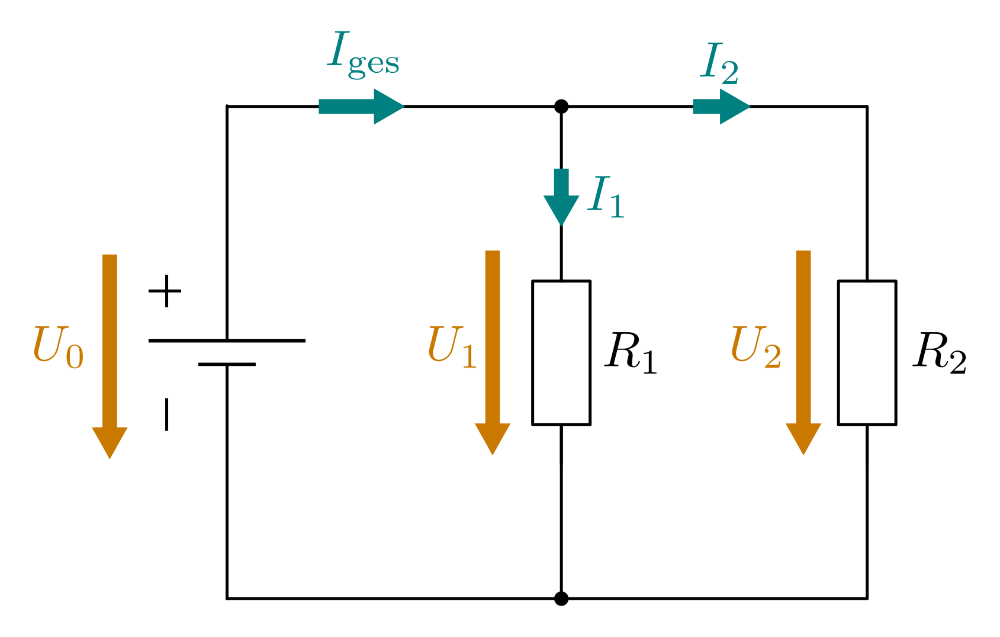

.. _Konventionen für das Erstellen von Schaltplänen:

Konventionen für das Erstellen von Schaltplänen
-----------------------------------------------

In der Elektronik haben sich neben der Konvention der technischen Stromrichtung
("von Plus nach Minus") weitere Vereinbarungen durchgesetzt, welche die
Kommunikation zwischen Elektronikern beziehungsweise die Analyse von
Schaltungen erleichtern:

* In Schaltplänen wird die Stromquelle nach Möglichkeit *links* im Schaltplan
  eingezeichnet.

* Bereiche mit hohen Spannungswerten (genau genommen: :ref:`Elektrischen
  Potentialen <gwp:Elektrisches Potential>`) werden nach Möglichkeit *oben*,
  Bereiche mit niedrigen Spannungswerten *unten* eingezeichnet.

  Damit ergibt sich ein tendentieller Stromverlauf von links oben nach rechts
  unten; im unteren Teil der Schaltung fließt der Strom schließlich (bei einem
  niedrigen elektrischen Potential) wieder nach links zum Minus-Pol der
  Stromquelle ab.

* Elektrische Stromstärken werden (nach Möglichkeit mittels horizontaler Pfeile)
  an einzelnen Leiterstücken angegeben.

* An Bauteilen anliegende Spannungen werden neben den Bauteilen angegeben;
  zusätzlich kann ein geradliniger Pfeil eingezeichnet werden, der vom höheren
  elektrischen zum niedrigeren elektrischen Potential zeigt.

.. todo pic Stromquelle Widerstand zwei Pfeile wie Hagmann2011 24

    Schaltplan-Konventionen für das Einzeichnen von Stromstärken und Spannungen.

    .. only:: html

        :download:`SVG: Schaltplan-Konventionen
        <../pics/schaltungen/schaltplan-konventionen.svg>`

Die Konventionen bezüglich des Einzeichnens von Stromstärke- und
Spannungs-Werten erfolgt in Anlehnung an die :ref:`Strom- und Spannungsmessung
<Mess- und Prüfschaltungen>`: Bei einer Spannungsmessung wird das Messgerät "von
außen" mit zwei Anschlüssen eines Bauteils verbunden; bei einer Messung der
Stromstärke muss das Messgerät in eine leitende Verbindung eingebaut werden.

Nicht immer können die oben genannten Konventionen eingehalten werden. Ist
beispielsweise der Schaltplan sehr groß, so ist es nicht unbedingt für jeden
Teilbereich möglich oder sinnvoll, die jeweilige Spannungsversorgung als von
links kommend einzuzeichnen.

Auch bei Schaltungen, in denen es hauptsächlich um eine Übertragung von
Information geht, kann die Einhaltung der obigen Konventionen schwierig bis
unmöglich sein. Beispielsweise ist es bei Audio-Signalen oder gepulsten Signalen
oftmals nicht sinnvoll, den einzelnen Bauteilen Spannungswerte zuzuordnen, da
sich diese während der Informationsübertragung ständig ändern können. Angaben
von Spannungen beziehungsweise Stromstärken sind also nur in Schaltungen
beziehungsweise Bereichen sinnvoll, in denen die jeweiligen Werte konstant
bleiben.

