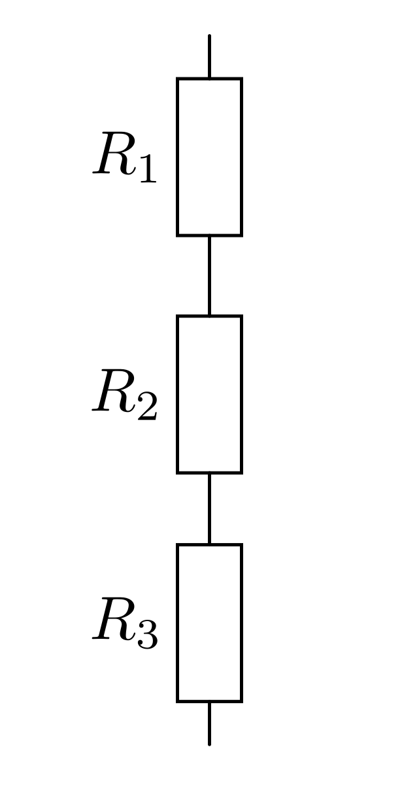
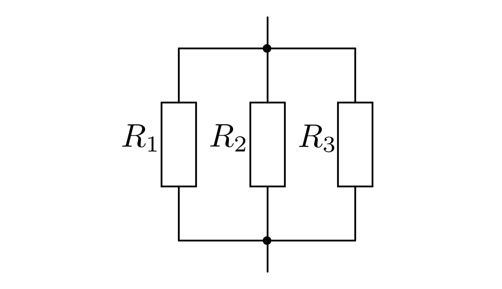
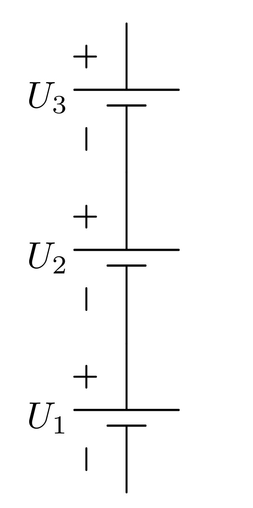
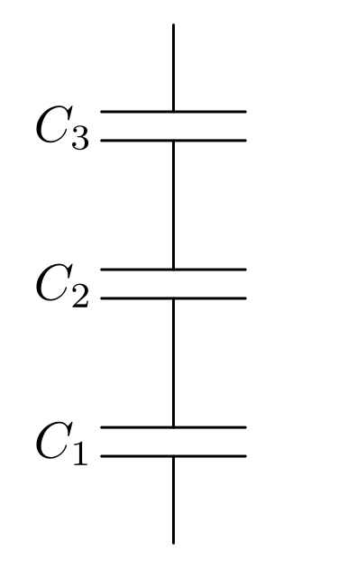
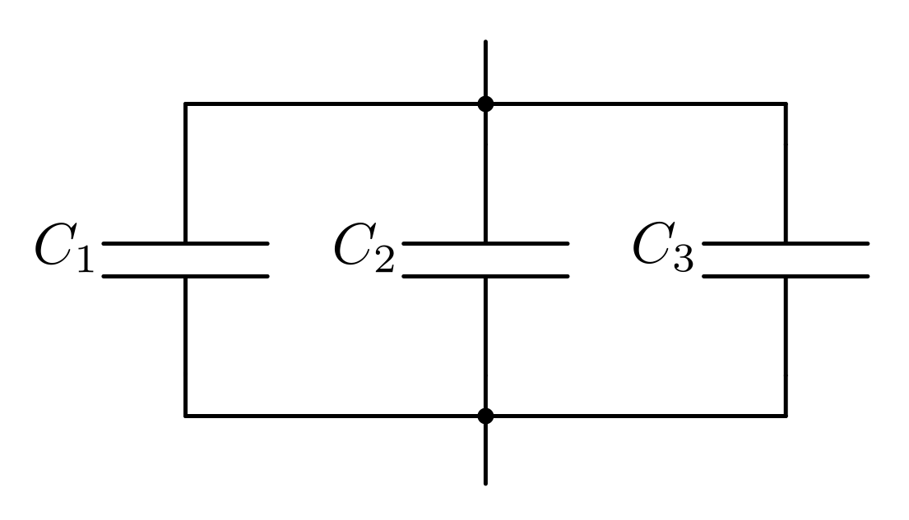
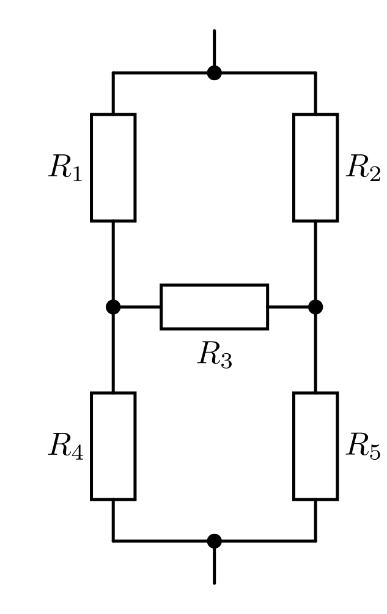
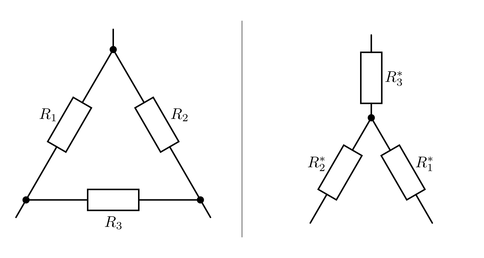
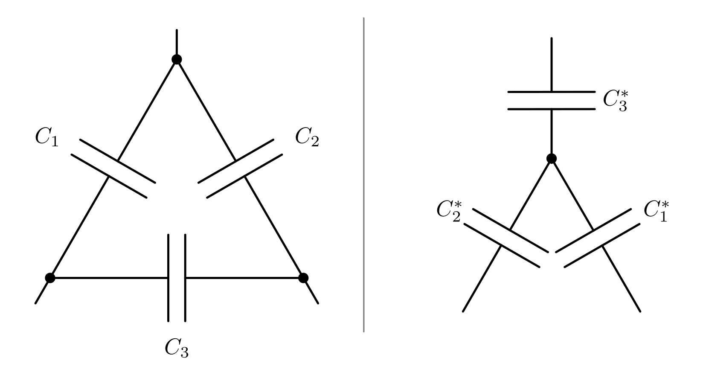

.. index::
    single: Reihenschaltung
    single: Parallelschaltung
.. _Reihen- und Parallelschaltungen:

Reihen- und Parallelschaltungen
===============================

Im folgenden wird behandelt, welche Auswirkungen sich durch eine Reihen- oder
Parallelschaltung mehrerer Widerstände, Stromquellen oder Kondensatoren
ergeben.

.. _Reihen- und Parallelschaltung von Widerständen:
.. _Reihen- und Parallelschaltungen von Widerständen:

Reihen- und Parallelschaltung von Widerständen
----------------------------------------------

In (fast) jedem Stromkreis befinden sich mehrere Verbraucher, also elektrische
Widerstände. Wie diese in ihrer Gesamtheit wirken, hängt davon ab, ob sie
parallel oder in Reihe geschaltet sind.

..  (Verbrauchern)

.. index:: Reihenschaltung; von Widerständen
.. _Reihenschaltung von Widerständen:

.. rubric:: Reihenschaltung von Widerständen

Bei einer Reihenschaltung von :math:`n` Widerständen ist der Gesamtwiderstand
:math:`R_{\mathrm{ges}}` gleich der Summe der Einzelwiderstände :math:`R_1,\;
R_2,\; \ldots,\; R_{\mathrm{n}}`:

.. math::
    :label: eqn-reihenschaltung-widerstand

    R_{\mathrm{ges}} &= R_1 + R_2 + \ldots + R_{\mathrm{n}} \\
    &= \sum_{i=1}^{n} R  _{\mathrm{i}}

Werden beispielsweise drei Widerstände der Größe :math:`R = \unit[100]{\Omega }`
in Reihe geschaltet, so wirken sie zusammen wie ein Widerstand der Größe
:math:`R_{\mathrm{ges}} = \unit[100]{\Omega} + \unit[100]{\Omega} +
\unit[100]{\Omega} = \unit[300]{\Omega}`.

    Reihenschaltung von drei Widerständen.

    .. only:: html

        :download:`SVG: Reihenschaltung von Widerständen
        <../pics/schaltungen/reihenschaltung-von-widerstaenden.svg>`

Die an einer Reihenschaltung anliegende Gesamtspannung :math:`U_{\mathrm{ges}}`
teilt sich gemäß der :ref:`Maschenregel <Die Maschenregel>` in :math:`n`
Teilspannungen :math:`U_1,\; U_2,\; \ldots` auf. Dabei ist die Gesamtspannung
gleich der Summe der einzelnen Teilspannungen:

.. math::
    :label: eqn-reihenschaltung-spannung

    U_{\mathrm{ges}} &= U_1 + U_2 + \ldots + U_{\mathrm{n}} \\
    &= \sum_{i=1}^{n} U_{\mathrm{i}}

Die Stromstärke :math:`I_{\mathrm{ges}}`, die mehrere in Reihe geschaltete
Widerstände durchfließt, ist an allen Stellen der Reihenschaltung gleich. Somit
gilt:

.. math::
    :label: eqn-reihenschaltung-stromstärke

    I_{\mathrm{ges}} = I_1 = I_2 = \ldots = I_{\mathrm{n}}

Diese Tatsache wird unter anderem zur :ref:`Stromstärkemessung <Strommessung>`
genutzt, indem ein Amperemeter an einer beliebigen Stelle in den zu
untersuchenden (Teil-)Stromkreis als Reihenschaltung eingefügt wird.

Ist der Widerstandswert :math:`R` eines Widerstands einer Reihenschaltung
bekannt, kann mit Hilfe der obigen Formeln und des :ref:`Ohmschen Gesetzes
<Ohmsches Gesetz>` auf die am Widerstand anliegende Spannung :math:`U`
beziehungsweise auf die durch den Widerstand fließende Stromstärke :math:`I`
geschlossen werden:

.. math::

    U = R \cdot I_{\mathrm{ges}} \quad ; \quad I = I_{\mathrm{ges}} = \frac{U
    _{\mathrm{ges}}}{R_{\mathrm{ges}}}

.. Leistungen: Mit P = I^2*R folgt P1/P2 = R1/R2

.. index:: Parallelschaltung; von Widerständen
.. _Parallelschaltung von Widerständen:

.. rubric:: Parallelschaltung von Widerständen

Bei einer Parallelschaltung von :math:`n` Widerständen addieren sich die
Kehrwerte der Einzelwiderstände :math:`R_1,\; R_2,\; \ldots` zum Kehrwert des
Gesamtwiderstandes :math:`R_{\mathrm{ges}}` auf:

.. math::
    :label: eqn-parallelschaltung-widerstand

    \frac{1}{R_{\mathrm{ges}}} &= \frac{1}{R_1} + \frac{1}{R_2} + \ldots +
    \frac{1}{R_{\mathrm{n}}} \\
    &= \sum_{i=1}^{n} \frac{1}{R_{\mathrm{i}}}

Werden beispielsweise drei Widerstände der Größe :math:`R = \unit[100]{\Omega}`
parallel zueinander geschaltet, so ergibt sich für den Kehrwert des
Gesamtwiderstands :math:`\frac{1}{R_{\mathrm{ges}}} =
\unit[\frac{1}{100}]{\Omega} + \unit[\frac{1}{100}]{\Omega} +
\unit[\frac{1}{100}]{\Omega} = \unit[\frac{3}{100} ]{\Omega }`. Der
Gesamtwiderstand beträgt somit :math:`R_{\mathrm{ges}} =
\unit[\frac{100}{3}]{\Omega} \approx \unit[33,3]{\Omega}`.

    Parallel von drei Widerständen.

    .. only:: html

        :download:`SVG: Parallelschaltung von Widerständen
        <../pics/schaltungen/parallelschaltung-von-widerstaenden.svg>`

An allen :math:`n` Widerständen einer Parallelschaltung liegt die gleiche
Spannung an. Diese ist gleich der Gesamtspannung :math:`U_{\mathrm{ges}}`:

.. math::
    :label: eqn-parallelschaltung-spannung

    U_{\mathrm{ges}} = U_1 = U_2 = \ldots = U_{\mathrm{n}}

Diese Tatsache wird unter anderm zur :ref:`Spannungsmessung <Spannungsmessung>`
genutzt, indem ein Voltmeter parallel zum untersuchten (Teil-)Stromkreis
beziehungsweise Bauteil geschalten wird.

Die Stromstärke :math:`I_{\mathrm{ges}}` teilt sich bei einer Parallelschaltung
gemäß der :ref:`Knotenregel <Die Knotenregel>` auf :math:`n` Teilstromstärken
auf:

.. math::
    :label: eqn-parallelschaltung-stromstärke

    I_{\mathrm{ges}} &= I_1 + I_2 + \ldots + I_{\mathrm{n}} \\
    &= \sum_{i=1}^{n} I_{\mathrm{i}}

Ist der Widerstandswert :math:`R` eines Widerstands einer Parallelschaltung
bekannt, kann wiederum mit Hilfe der obigen Formeln und des :ref:`Ohmschen
Gesetzes <Ohmsches Gesetz>` auf die am Widerstand anliegende Spannung :math:`U`
beziehungsweise auf die durch den Widerstand fließende Stromstärke :math:`I`
geschlossen werden:

.. math::

    U = U_{\mathrm{ges}} \quad ; \quad I = \frac{U_{\mathrm{ges}}}{R}

.. Leistungen: Mit P = U^2/R folgt P1/P2 = R2/R1

.. _Reihen- und Parallelschaltung von Stromquellen:

Reihen- und Parallelschaltung von Stromquellen
----------------------------------------------

Um in einem Stromkreis eine höhere Spannung oder eine größere nutzbare
Stromstärke herbeizuführen, können auch mehrere Stromquellen (z.B. Batterien,
Akkumulatoren oder Solarzellen) in Reihe oder parallel zueinander geschalten
werden.

.. index:: Reihenschaltung; von Stromquellen
.. _Reihenschaltung von Stromquellen:

.. rubric:: Reihenschaltung von Stromquellen

Werden :math:`n` Stromquellen in Reihe geschaltet, so addieren sich ihre
einzelnen Spannungswerte :math:`U_1,\; U_2,\; U_{\mathrm{n}}` zu
einer Gesamtspannung :math:`U_{\mathrm{ges}}`:

.. math::

    U_{\mathrm{ges}} &= U_1 + U_2 + \ldots + U_{\mathrm{n}} \\
    &= \sum_{i=1}^{n} U_{\mathrm{i}}

Diese Gleichung ist formal mit Gleichung :eq:`eqn-reihenschaltung-spannung` identisch.
Der Unterschied liegt in der entgegengesetzten Wirkungsweise von Stromquellen
und Widerständen:

* In einer Reihenschaltung wird durch das Hinzufügen eines zusätzlichen
  Widerstands :math:`R_{\mathrm{\downarrow}}` die an den übrigen Verbrauchern
  anliegende Spannung auf :math:`U_{\mathrm{neu}} = U_{\mathrm{ges}} -
  R_{\mathrm{\downarrow}} \cdot I_{\mathrm{ges}}` reduziert.
* In einer Reihenschaltung wird durch das Hinzufügen einer zusätzlichen
  Stromquelle :math:`U_{\mathrm{\uparrow}}` die an den übrigen Verbrauchern
  anliegende Spannung auf :math:`U_{\mathrm{neu}} = U_{\mathrm{ges}} +
  U_{\mathrm{\uparrow}}` erhöht.

    Reihenschaltung von drei Stromquellen.

    .. only:: html

        :download:`SVG: Reihenschaltung von Stromquellen
        <../pics/schaltungen/reihenschaltung-von-stromquellen.svg>`

Schaltet man :math:`n` gleichartige Stromquellen in Reihe, so weist die
resultierende Stromquelle eine :math:`n`-fache Spannung auf.

.. index:: Parallelschaltung; von Stromquellen
.. _Parallelschaltung von Stromquellen:

.. rubric:: Parallelschaltung von Stromquellen

Werden :math:`n` Stromquellen parallel zueinander geschaltet, so reduzieren sich
die Teilstromstärken :math:`I_1,\; I_2,\; \ldots`, die jede
einzelne Stromquelle zur gesamten Stromstärke :math:`I_{\mathrm{ges}}` beisteuert.

.. math::

    I_{\mathrm{ges}} &= I_1 + I_2 + \ldots + I_{\mathrm{n}} \\
    &= \sum_{i=1}^{n} I_{\mathrm{i}}

Diese Gleichung ist formal mit Gleichung :eq:`eqn-parallelschaltung-stromstärke`
identisch. An dieser Stelle hat sie zweierlei gleichsam gültige Wirkungen zur
Folge:

* Wird eine Stromquelle, die eine maximale Stromstärke :math:`I_{\mathrm{\uparrow}}`
  liefern kann, parallel zu einer bestehenden Stromquelle geschaltet, so erhöht
  sich die insgesamt mögliche Stromstärke auf :math:`I_{\mathrm{max,neu}} =
  I_{\mathrm{max,alt}} + I_{\mathrm{\uparrow}}`. [#]_

  .. pic

* Wird eine weitere Stromquelle :math:`I_{\mathrm{\uparrow}}` parallel zu einem
  bestehenden Stromkreis geschaltet, so wird die bisherige Stromquelle auf
  :math:`I_{\mathrm{neu}} = I_{\mathrm{ges}} - I_{\mathrm{\uparrow}}`
  "entlastet". Bei Stromquellen mit einem begrenzten Energiespeicher,
  beispielsweise Batterien und Akkumulatoren, wird dadurch die Entladezeit
  ("Lebensdauer") entsprechend erhöht. [#]_

.. figure::
    ../pics/schaltungen/parallelschaltung-von-stromquellen.png
    :name:  fig-parallelschaltung-von-stromquellen
    :alt:   fig-parallelschaltung-von-stromquellen
    :align: center
    :width: 30%

    Parallelschaltung von drei Stromquellen.

    .. only:: html

        :download:`SVG: Parallelschaltung von Stromquellen
        <../pics/schaltungen/parallelschaltung-von-stromquellen.svg>`

Bei einer Parallelschaltung von :math:`n` gleichartigen Stromquellen wird die
maximal mögliche Stromstärke um das :math:`n`-fache erhöht beziehungsweise die
einzelnen von den Stromquellen bereitgestellten (Teil-)Stromstärken um das
:math:`\frac{1}{n}`-fache reduziert.

.. _Reihen- und Parallelschaltung von Kondensatoren:

Reihen- und Parallelschaltung von Kondensatoren
-----------------------------------------------

Kondensatoren gehören ebenfalls zu den häufig verwendeten elektronischen
Bauteilen. Durch eine Reihen- oder Parallelschaltung mehrerer Kondensatoren
lässt sich ihre charakteristische Größe, die Kapazität :math:`C`,
beeinflussen.

.. index:: Reihenschaltung; von Kondensatoren
.. _Reihenschaltung von Kondensatoren:

.. rubric:: Reihenschaltung von Kondensatoren

Werden :math:`n` Kondensatoren in Reihe geschaltet, so werden bei Anlegen der
Spannung :math:`U`  alle mit der gleichen Stromstärke :math:`I` auf eine
Ladungsmenge :math:`Q`  aufgeladen.

    Reihenschaltung von drei Kondensatoren.

    .. only:: html

        :download:`SVG: Reihenschaltung von kondensatoren
        <../pics/schaltungen/reihenschaltung-von-kondensatoren.svg>`

Wie bei Reihenschaltungen üblich, addieren sich dabei die an den einzelnen
Kondensatoren abfallenden Teilspannungen :math:`U_{\mathrm{i}}`, die sich mit
Hilfe der allgemeinen Kondensator-Formel :math:`(Q = C \cdot U)` als
:math:`U_{\mathrm{i}} = Q / C_{\mathrm{i}}` ausdrücken lassen:

.. math::

    U_{\mathrm{ges}} = \frac{Q}{C_1} + \frac{Q}{ C_2} + \ldots =
    \sum_{i=1}^{n} \frac{Q}{C_{\mathrm{i}}}

Um herauszufinden, wie mehrere Kondensatoren in ihrer Gesamtheit wirken, d.h.
welche Gesamt-Kapazität :math:`C_{\mathrm{ges}}` sich aus der Reihenschaltung
der :math:`n` einzelnen Kondensatoren :math:`C_{\mathrm{i}}` ergibt, muss man
beide Seiten der obigen Gleichung durch die konstante Ladung :math:`Q` teilen.
Die linke Seite der Gleichung entspricht dann der Gesamtkapazität
:math:`C_{\mathrm{ges}} = U_{\mathrm{ges}} / Q`, die rechte Seite der Summe
aller Kehrwerte der einzelnen Kondensatoren:

.. math::
    :label: eqn-reihenschaltung-kondensator

    \frac{1}{C_{\mathrm{Ges}} } = \sum_{i=1}^{n} \frac{1}{C_{\mathrm{i}}}

Wird zu einem bestehenden Kondensator ein weiterer in Reihe geschaltet, so nimmt
die Gesamtkapazität ab. Kondensatoren verhalten sich in einer Reihenschaltung
somit ähnlich wie Widerstände in einer Parallelschaltung.

.. index:: Parallelschaltung; von Kondensatoren
.. _Parallelschaltung von Kondensatoren:

.. rubric:: Parallelschaltung von Kondensatoren

Werden :math:`n`  Kondensatoren parallel zueinander geschaltet, so liegt an
allen die gleiche Spannung :math:`U` an. Der Gesamtstrom :math:`I_{\mathrm{ges}}`
teilt sich in :math:`n` Teilströme auf, wodurch die einzelnen Kondensatoren mit
unterschiedlichen Ladungen :math:`Q_{\mathrm{i}}` geladen werden.

    Parallelschaltung von drei Kondensatoren.

    .. only:: html

        :download:`SVG: Parallelschaltung von kondensatoren
        <../pics/schaltungen/parallelschaltung-von-kondensatoren.svg>`

Mit Hilfe der allgemeinen Kondensator-Formel :math:`(Q = C \cdot U)` lässt sich
die Gesamt-Kapazität :math:`C_{\mathrm{ges}}` direkt ausdrücken:

.. math::

    C_{\mathrm{ges}} = \frac{Q_{\mathrm{ges}}}{U} = \frac{Q_1}{U} + \ldots +
    \frac{Q_{\mathrm{n}}}{U}  = \sum_{i=1}^{n}  \frac{Q_{\mathrm{i}}}{U}

Die einzelnen Quotienten :math:`Q_{\mathrm{i}} / U` entsprechen dabei den einzelnen
Kapazitäten :math:`C_{\mathrm{i}}` der parallel zueinander geschalteten
Kondensatoren. Somit gilt:

.. math::
    :label: eqn-parallelschaltung-kondensator

    C_{\mathrm{Ges}} = \sum_{i=1}^{n} C  _{\mathrm{i}}

Eine Parallelschaltung zweier oder mehrerer Kondensatoren gleicht somit einem
einzigen Kondensator mit einer entsprechend größeren Kapazität. Kondensatoren
verhalten sich in einer Parallelschaltung somit ähnlich wie Widerstände in einer
Reihenschaltung.

.. Spannungsteiler
.. ---------------

.. ... to be continued ...

.. index:: Stern-Dreieck-Umwandlung, Dreieck-Stern-Umwandlung
.. _Stern-Dreieck-Umwandlung:
.. _Dreieck-Stern-Umwandlung:

Stern-Dreieck-Umwandlung
------------------------

Um in einem Stromkreis mit mehreren Widerständen die einzelnen auftretenden
Stromstärken und Spannungen zu bestimmen, können diese schrittweise durch
Ersatz-Widerstände für :ref:`Reihen- und Parallelschaltungen von Widerständen
<Reihen- und Parallelschaltung von Widerständen>`  ersetzt werden. Bisweilen
können allerdings auch Schaltungen auftreten, bei denen eine solche Ersetzung
nicht unmittelbar möglich ist. Eine solche Schaltung ist in der folgenden
Abbildung beispielhaft gezeigt:

    Beispielschaltung für eine Dreieck-Stern-Umwandlung.

    .. only:: html

        :download:`SVG: Dreieck-Stern-Beispielschaltung
        <../pics/schaltungen/stern-dreieck-umwandlung-beispiel.svg>`

Bei der obigen Beispiel-Schaltung kann man beispielsweise nicht unmittelbar
sagen, ob der Widerstand :math:`R_3` nun in Reihe oder parallel zu den übrigen
Widerständen geschaltet ist. In so einem Fall ist es jedoch möglich, eine
"dreieckige" Schaltung in eine "sternförmige" umzuwandeln:

    Symbolhafte Darstellung einer Dreieck- und einer zugehörigen
    Stern-Schaltung.

    .. only:: html

        :download:`SVG: Dreieck- und Stern-Schaltung
        <../pics/schaltungen/stern-und-dreieck-schaltung.svg>`

Bei einer derartigen "Dreieck-Stern-Umwandlung" werden sowohl die Anordnungen
wie auch die Bezeichnungen der Widerstände geändert. Die Zuordnung geschieht
dabei wie bei einem geometrischen Rechteck, bei dem beispielsweise die
Dreieck-Seite :math:`c` dem Punkt :math:`C` gegenüberliegt.

* Die Werte der durch eine Dreieck-Stern-Umwandlung resultierenden Widerstände
  können folgendermaßen berechnet werden:

  .. math::

      R_1^{*} &= \frac{R_2 \cdot R_3}{R_1 + R_2 + R_3} \\[4pt]
      R_2^{*} &= \frac{R_1 \cdot R_3}{R_1 + R_2 + R_3} \\[4pt]
      R_3^{*} &= \frac{R_1 \cdot R_2}{R_1 + R_2 + R_3}

  Die resultierenden Widerstandswerte sind somit jeweils gleich dem Produkt der
  beiden anliegenden Widerstände, geteilt durch die Summe aller drei Widerstände.

* Die Umwandlung kann bei Bedarf auch in der umgekehrten Richtung vorgenommen
  werden. Für die Werte der durch eine Stern-Dreieck-Umwandlung resultierenden
  Widerstände gilt entsprechend:

 .. math::

     R_1 &= R_2^{\,*} + R_3^{*} + \frac{R_2^{*} \cdot R_3^{*}}{R_1^{*}} \\[4pt]
     R_2 &= R_1^{\,*} + R_3^{*} + \frac{R_1^{*} \cdot R_3^{*}}{R_2^{*}} \\[4pt]
     R_3 &= R_1^{\,*} + R_2^{*} + \frac{R_1^{*} \cdot R_2^{*}}{R_3^{*}}

*Beispiel:*

* In der am Anfang dieses Abschnitts abgebildeten
  :ref:`Stern-Dreieck-Beispielschaltung <fig-stern-dreick-umwandlung-beispiel>`
  soll für :math:`R_1 = R_2 = \unit[10]{\Omega}`, :math:`R_3 =
  \unit[20]{\Omega}` und :math:`R_4 = R_5 = \unit[50]{\Omega}` gelten. Wie groß
  ist in diesem Fall der Gesamtwiderstand :math:`R_{\mathrm{Ges}}` dieser
  Schaltung?

  .. figure::
      ../pics/schaltungen/stern-dreieck-umwandlung-beispiel-loesung.png
      :name:  fig-stern-dreick-umwandlung-beispiel-loesung
      :alt:   fig-stern-dreick-umwandlung-beispiel-loesung
      :align: center
      :width: 60%

      Beispielschaltung für Dreieck-Stern-Umwandlungen (Lösung).

      .. only:: html

          :download:`SVG: Dreieck-Stern-Beispielschaltung (Lösung)
          <../pics/schaltungen/stern-dreieck-umwandlung-beispiel-loesung.svg>`

  Nimmt man für Anordnung der Widerstände :math:`R_1`, :math:`R_2` und
  :math:`R_3` eine Dreieck-Stern-Umwandlung vor, so erhält man eine Schaltung,
  die sich auf eine Reihen- und Parallelschaltung von Widerständen zurückführen
  lässt. Für die "neuen" Widerstandswerte :math:`R_1^{*}`, :math:`R_2^{*}` und
  :math:`R_3^{*}` gilt dabei:

  .. math::

      R_1^{*} &= \frac{R_2 \cdot R_3}{R_1 + R_2 + R_3} = \unit[\frac{10 \cdot
      20}{10 + 10 + 20}]{\Omega} = \unit[5,0]{\Omega} \\[4pt] R_2^{*} &=
      \frac{R_1 \cdot R_3}{R_1 + R_2 + R_3} = \unit[\frac{10 \cdot 20}{10 + 10 +
      20}]{\Omega} = \unit[5,0]{\Omega} \\[4pt] R_3^{*} &= \frac{R_1 \cdot
      R_2}{R_1 + R_2 + R_3} = \unit[\frac{10 \cdot 10}{10 + 10 + 20}]{\Omega} =
      \unit[2,5]{\Omega}

  Nach der Umwandlung sind die Widerstände :math:`R_1^{*}` und :math:`R_5` sowie
  die Widerstände :math:`R_2^{*}` und :math:`R_4` in Reihe geschalten. Da in
  diesem Fall :math:`R_1^{*}` und :math:`R_2^{*}` beide den Wert
  :math:`\unit[5,0]{\Omega}` sowie :math:`R_4` und :math:`R_5` beide den Wert
  :math:`\unit[50]{\Omega}` haben, ergibt sich für die beiden Ersatzwiderstände
  :math:`R_{\mathrm{15}}` und :math:`R_{\mathrm{24}}`:

  .. math::

      R_{\mathrm{15}} &= R_1^{*} + R_5 = \unit[5,0]{\Omega} + \unit[50]{\Omega} =
      \unit[55]{\Omega} \\
      R_{\mathrm{25}} &= R_2^{*} + R_5 = \unit[5,0]{\Omega} + \unit[50]{\Omega} =
      \unit[55]{\Omega} \\

  Die Ersatz-Widerstände :math:`R_{\mathrm{15}}` und :math:`R_{\mathrm{24}}`
  sind parallel zueinander geschaltet; für den zugehörigen Ersatz-Widerstand
  :math:`R_{\mathrm{1245}}` ergibt sich damit:

  .. math::

      R_{\mathrm{1245}} = \frac{1}{\frac{1}{R_{24}} + \frac{1}{R_{35}} } =
      \unit[\frac{1}{\frac{1}{55} + \frac{1}{55}}]{\Omega} = \unit[27,5]{\Omega}

  Dieser Ersatzwiderstand ist schließlich in Reihe mit :math:`R_3^{*}`
  geschaltet; somit ergibt sich als Gesamt-Widerstand :math:`R_{\mathrm{Ges}} =
  R_3^{*} + R_{\mathrm{1245}} = \unit[(2,5+ 27,5)]{\Omega} =
  \unit[30]{\Omega}`.

.. _Stern-Dreieck-Umwandlung bei Kondensatoren:

.. rubric:: Stern-Dreieck-Umwandlung bei Kondensatoren

Kondensatoren verhalten sich bei Reihen- beziehungsweise Parallelschaltungen
genau umgekehrt wie Widerstände: Bei Parallelschaltungen addieren sich ihre
Kapazitätswerte, bei Reihenschaltungen hingegen die Kehrwerte ihrer Kapazitäten.

    Symbolhafte Darstellung einer Dreieck- und einer zugehörigen
    Stern-Schaltung mit Kondensatoren.

    .. only:: html

        :download:`SVG: Dreieck- und Stern-Schaltung mit Kondensatoren
        <../pics/schaltungen/stern-und-dreieck-schaltung-mit-kondensatoren.svg>`

Man kann dennoch das Prinzip der Stern-Dreieck-Umwandlung auch auf Kondensatoren
übertragen, wenn man mit den Kehrwerten ihrer Kapazitäten beziehungsweise mit
den entsprechenden :ref:`Blindwiderständen <Kondensator im Wechselstromkreis>`
rechnet :math:`R_{\mathrm{C}}` der einzelnen Kondensatoren rechnet. [#]_ Man
erhält dabei folgende Umrechnungen:

.. Siehe auch https://www.physicsforums.com/threads/y-delta-conversion-for-capacitors.462118/

* Bei einer Dreieck-Stern-Umwandlung von Kondensatoren können die resultierenden
  Werte der Kapazitäten folgendermaßen berechnet werden:

  .. math::

      C_1^{*} &= \frac{C_1 \cdot C_2 + C_1 \cdot C_3 + C_2 \cdot C_3}{C_1}
      \\[4pt]
      C_2^{*} &= \frac{C_1 \cdot C_2 + C_1 \cdot C_3 + C_2 \cdot C_3}{C_2}
      \\[4pt]
      C_3^{*} &= \frac{C_1 \cdot C_2 + C_1 \cdot C_3 + C_2 \cdot C_3}{C_3}

* Für die Werte der durch eine Stern-Dreieck-Umwandlung resultierenden
  Kapazitäten gilt entsprechend:

  .. math::

      C_1 &= \frac{C_2^{*} \cdot C_3^{*}}{C_1^{*} + C_2^{*} + C_3^{*}} \\[4pt]
      C_2 &= \frac{C_1^{*} \cdot C_3^{*}}{C_1^{*} + C_2^{*} + C_3^{*}} \\[4pt]
      C_3 &= \frac{C_1^{*} \cdot C_2^{*}}{C_1^{*} + C_2^{*} + C_3^{*}}

Auch bei Kondensatoren werden Stern-Dreieck- beziehungsweise
Dreieck-Stern-Umwandlungen so lange durchgeführt, bis sich aus den
resultierenden Ersatz-Kapazitäts-Werten eine Schaltung ergibt, die nur noch aus
Reihen- und/oder Parallelschaltungen von Kondensatoren besteht.

.. raw:: html

    

.. only:: html

    .. rubric:: Anmerkungen:

.. [#] Dies ist in der Praxis von Nutzen, wenn weitere (Verbraucher-)Widerstände
    parallel zu einem bestehenden Stromkreis geschaltet werden: Die Spannung
    :math:`U` bleibt dabei unverändert, der Gesamt-Widerstand nimmt ab und die
    nötige Stromstärke steigt. Um eine Batterie beziehungsweise einen
    Akkumulator nicht zu überlasten, wird auch die bestehende Stromquelle um
    eine oder mehrere (meist gleichartig gebaute) parallel geschaltene
    Stromquellen erweitert.

.. [#] Die gespeicherte Energiemenge einer Batterie oder eines Akkumulators ist
    gleich :math:`E = U \cdot I \cdot t`, wobei :math:`t` die Entladungszeit
    angibt. Bei einer Parallelschaltung bleibt die Spannung :math:`U`
    unverändert. Die gleiche Energiemenge :math:`E` entlädt sich somit aufgrund
    der niedrigeren Stromstärke :math:`I` über einen entsprechend längeren
    Zeitraum :math:`t`.

.. [#] Für den Blindwiderstand :math:`R_{\mathrm{C}}` eines Kondensators mit
    einer Kapazität :math:`C` gilt (bei Wechselströmen):

    .. math::

        R_{\mathrm{C}} = \frac{1}{\omega \cdot C}

    Die Frequenz :math:`\omega` des Wechselstroms ist bei einer
    Stern-Dreieck-Umwandlung eine Konstante und kann bei der Umwandlung
    "ausgeklammert" werden.

.. raw:: html

    

.. hint::

    Zu diesem Abschnitt gibt es :ref:`Übungsaufgaben <Aufgaben Reihen- und
    Parallelschaltungen>`.

.. :ref:`Experimente <Experimente Reihen- und Parallelschaltungen>` und
