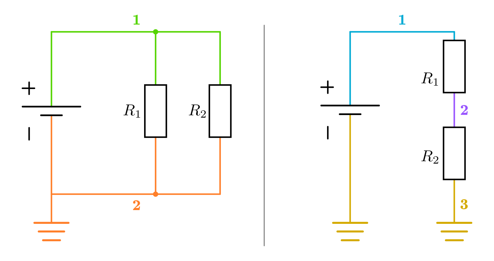

.. index:: Netzwerk, Netzwerk-Knoten, Netz-Liste
.. _Netzwerke und Netzwerk-Knoten:

Netzwerke und Netzwerk-Knoten
-----------------------------

Im elektro-technischen Sprachgebrauch werden Schaltungs-Diagramme bisweilen auch
als Netzwerke bezeichnet. Beide Begriffe werden in diesem Zusammenhang als
Synonyme behandelt, ein elektronisches "Netzwerk" muss also nicht mit
beispielsweise einem Rechner-Netzwerk oder einer Internet-Verbindung zu tun
haben.

.. _Netzwerk-Knoten:

Innerhalb eines Netzwerks ist es üblich, jeweils alle Linien, die unmittelbar
miteinander in Kontakt stehen, als "Knoten" zu bezeichnen. Der Hintergedanke
hierbei ist, dass Leitungen in Schaltplänen als ideale Leiter angesehen werden,
also (auch bei beliebiger Länge) keinen elektrischen Widerstand aufweisen. Der
elektrische Strom "sieht" die Leitung also nicht als eigenes Bauteil, er "sieht"
nur die unmittelbar mittels der Leitung verbundenen weiteren Bauteile.

Jedem Netzwerk-Knoten kann eindeutig eine bestimmte Spannung (genau genommen:
Ein :ref:`elektrisches Potential <gwp:Elektrisches Potential>`) zugewiesen
werden; kennt man Werte der einzelnen Knoten, so weiß man ebenso, wie groß die
Spannungen sind, die entlang der einzelnen Bauteile abfallen.

    Zwei Schaltungen mit zwei beziehungsweise drei Netzwerk-Knoten.

    .. only:: html

        :download:`SVG: Netzwerk-Knoten
        <../pics/schaltungen/netzwerk-knoten.svg>`

Praktisch kann man die einzelnen Knoten eines Schaltungs-Netzwerks dadurch
herausfinden, indem man in einem Schaltplan jeweils ein Linien-Stück mit einem
Stift entlangfährt, ohne ein anderes Bauteil zu passieren oder den Stift
abzusetzen. Die einzelnen Knoten einer Schaltung können im Schaltplan
beispielsweise anschaulich mit verschiedenen Farben markiert oder
durchnummeriert werden.

Ebenso kann das Knoten-Konzept verwendet werden, um Schaltpläne zu beschreiben.
Nummeriert man die in einer Schaltung vorhandenen Knoten mit
:math:`1,\,2,\,3,\,\ldots` durch, so genügt es zur Beschreibung der Schaltung,
dass man für jedes einzelne Bauteil angibt, welche Knoten durch das Bauteil
miteinander verbunden werden. [#]_

Die Darstellungsweise eines Schaltplans als "Netz-Liste" mag für einen
menschlichen Betrachter weniger anschaulich sein als ein graphisch gezeichneter
Schaltplan; sie wird jedoch bevorzugt in Schaltungs-Simulations-Programmen
eingesetzt. 

.. raw:: html

    

.. only:: html

    .. rubric:: Anmerkungen:

.. [#] Eine Verbindung zweier Knoten mittels eines elektronischen Bauteils wird
    in diesem Zusammenhang häufig auch als "Netzwerk-Zweig" bezeichnet.

.. (in Anlehnung an die Graphen-Theorie)

