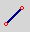

.. index:: QUCS (Simulations-Software)
.. _Simulationen mit QUCS:
.. _Schaltungs-Simulationen mit QUCS:

Schaltungs-Simulationen mit QUCS
================================

QUCS steht für "Quite Universal Circuit Simulator"; das Programm ist also darauf
ausgelegt, eine Vielzahl von Schaltungs-Simulationen möglich zu machen.

Unter Debian beziehungsweise Ubuntu oder Linux Mint kann QUCS folgendermaßen
installiert werden:

.. code-block:: sh

    sudo add-apt-repository ppa:fransschreuder1/qucs
    sudo aptitude update

    sudo aptitude install qucs

.. sudo add-apt-repository ppa:qucs/qucs

Möchte man auch digitale Schaltungen mit QUCS simulieren, sollten zudem folgende
Pakete installiert werden:

.. code-block:: sh

    sudo aptitude install freehdl libfreehdl0-dev

.. https://github.com/ra3xdh/qucs/releases/tag/0.0.19S-rc6

Anschließend kann das Programm über das Start-Menü oder aus einer Shell heraus
mittels Eingabe von ``qucs`` gestartet werden.

.. _Bedienung von QUCS:

Bedienung von QUCS
------------------

QUCS kann weitgehend mit der Maus bedient werden. Die Maustasten haben dabei
folgende Bedeutung:

* Mit einem Linksklick werden Bauteile je nach Bearbeitungs-Modus positioniert
  oder ausgewählt.

  Mit einem doppelten Linksklick auf ein Bauteil wird ein kleines Fenster
  geöffnet, in dem die charakteristischen Eigenschaften des Bauteils eingestellt
  werden können.

.. Die Kennwerte der Bauteile können im Bearbeitungsfenster durch ein doppeltes
.. Drücken der linken Maustaste verändert werden; als Alternative dazu kann auch die
.. rechte Maustaste gedrückt werden und "Edit Properties" ausgewählt werden.

* Mit einem Rechtsklick auf ein Bauteil wird ein Auswahlmenü geöffnet, das
  verschiedene auf das Bauteil anwendbare Funktionen bietet.

* Mit dem Mausrad kann der Schaltplan wie ein Blatt Papier nach oben
  beziehungsweise unten gescrollt werden.

  Hält man bei Betätigung des Mausrads die ``Shift``-Taste gedrückt, so kann man
  nach links beziehungsweise rechts scrollen.

  Hält man bei Betätigung des Mausrads die ``Ctrl``-Taste gedrückt, so kann man
  in den Schaltplan hinein beziehungsweise heraus zoomen.

.. _QUCS-Workflow:

.. rubric:: QUCS-Workflow

Ein typischer Arbeitsablauf sieht in QUCS folgendermaßen aus:

* In der linken Fensterhälfte (dem Auswahl-Bereich), können beispielsweise unter
  der Rubrik "Komponenten" Bauteile aufgelistet werden. Klickt man mit der
  linken Maustaste auf ein Bauteil, so kann es mit einem weiteren Linksklick in
  der rechten Fensterhälfte (dem Hauptfenster) eingefügt werden. [#]_

  .. figure:: simulationen/qucs-lumped-components.png
      :name: fig-lumped-components
      :alt:  fig-lumped-components
      :align: center
      :width: 30%

      Ausschnitt aus der Komponenten-Kategorie "Lumped Components".

  Die Bauteil-Komponenten sind in verschiedene Kategorien unterteilt: Unter
  ``Lumped Components`` werden beispielsweise Standard-Bauteile aufgelistet,
  unter ``Sources`` Strom- und Spannungsquellen, unter ``Probes`` virtuelle
  Multimeter, und unter ``Nonlinear Components`` Dioden und Transistoren. Neben
  diesen dort aufgelisteten "generischen" Typen, bei denen die Modell-Parameter
  frei eingegeben werden können, gibt es auch vorgefertigte Bauteile, deren
  Parameter mit den tatsächlich im Schaltplan verbauten Modellen sehr gut
  übereinstimmen. Diese können über das Menü ``Tool -> Component Library`` oder
  mittels der Tastenkombination ``Ctrl 5`` geladen werden. Beispielsweise kann
  über dieses Menü ein vorgefertigtes Modell für einen BC548C-Transistor per
  Drag-and-Drop mit der linken Maustaste ins Hauptfenster gezogen werden.

  .. figure:: simulationen/qucs-component-library.png
      :name: fig-component-library
      :alt:  fig-component-library
      :align: center
      :width: 70%

      Die "Component-Library" (Hotkey: ``Ctrl 5``).

  Optional können Bauteile vor dem Positionieren mittels eines Klicks auf die
  rechte Maustaste gedreht werden; dies ist auch zu einem späteren Zeitpunkt
  mittels der Tastenkombination ``Ctrl r`` möglich.

  .. todo pic

  Durch einen Linksklick auf das Werte-Feld eines Bauteils (oder einen
  Doppelklick auf das Bauteil) können die Bauteil-Parameter direkt eingegeben
  werden. Beispielsweise haben neu eingefügte Widerstände einen Standard-Wert
  von :math:`\unit[50]{Ohm}`; klickt man also auf diesen Wert, gibt ``100`` ein
  und drückt ``Enter``, so wird der neue Widerstandswert übernommen. Einheiten
  wie :math:`\unit{Ohm}` für einen Widerstand sind dabei optional; QUCS
  interpretiert Bauteil-Werte automatisch in der jeweiligen Standard-Einheit für
  das jeweilige Bauteil.

  Bei der Angabe von Bauteil-Werten kannen zudem beispielsweise ``1k`` für einen
  Ein-Kilo-Ohm-Widerstand oder ``1.0M`` für einen Ein-Mega-Ohm-Widerstand
  geschrieben werden. Entsprechend gibt es für kleine Einheiten die Vorsätze
  ``m`` für Milli, ``u`` für Mikro und ``p`` für Piko, was insbesondere für
  Kondensator-Parameter nützlich ist.

* Die eingefügten Bauteile können anschließend mittels des Draht-Werkzeugs
  verbunden werden; dieses kann man durch einen Klick auf das entsprechende Icon
  in der Symbolleiste oder mittels der Tastenkombination ``Ctrl e`` aktivieren.
  [#]_

  .. image:: simulationen/qucs-wire-symbol.png
      :align: center

  Mit einem Klick mit der linken Maustaste wird der Startpunkt der Verbindung,
  mit einem weiteren ein Zwischenpunkt beziehungsweise der Endpunkt festgelegt.
  Dabei rasten die Leitungen automatisch an den jeweils mit einem kleinen roten
  Kreis markierten Anschluss-Stellen ein. In einer fertig "verkabelten"
  Schaltung sollten folglich keine roten Kreise mehr zu sehen sein.

  Die Linien werden von QUCS automatisch vertikal oder horizontal ausgerichtet;
  an Knick-Stellen kann dabei mittels eines Klicks mit der rechten Maustaste
  umgeschaltet werden, in welche Richtung ein Knick erfolgen soll. Durch Drücken
  von ``Esc`` wird der Draht-Modus wieder beendet.

* In jedem Schaltplan muss zudem ein Leiterstück als Ground-Niveau (GND, bei
  DC-Schaltungen der Minus-Anschluss der Stromquelle) festgelegt werden, indem
  man in der Symbolleiste auf das entsprechende Symbol klickt und dieses --
  ähnlich wie ein Bauteil -- mit der gewünschten Leitung verbindet.

  .. image:: simulationen/qucs-ground-symbol.png
      :align: center

* Der Schaltplan kann über das Menü ``Datei -> Speichern`` oder mittels der
  Tastenkombination ``Ctrl s`` gespeichert werden. Um die Schaltung simulieren
  zu können, ist dies zwingend nötig, da QUCS die Ergebnis-Werte in eine
  zugehörige Datei schreibt.

  QUCS erstellt automatisch bei einer Simulation zu einer Schaltplan-Datei
  ``datei.sch`` eine Daten-Datei ``datei.sch``, in welche die für die Simulation
  notwendige Netzliste geschrieben wird.

  Zudem erstellt QUCS im gleichen Verzeichnis die Datei ``datei.dpl``, die für
  Daten-Plots (Diagramme oder Tabellen mit den simulierten Werten) vorgesehen
  ist. Möchte man die Ausgabe-Diagramme gemeinsam mit dem Schaltplan im gleichen
  Fenster angezeigt bekommen, so kann man im Menü ``Datei ->
  Datei-Einstellungen`` auswählen und den Eintrag "Data Display" von
  ``datei.dpl`` auf ``datei.sch`` ändern.

* Für eine der möglichen Simulationsarten muss aus der Bauteile-Rubrik
  "Simulationen" das gewünschte Symbol (DC, AC, Transient, Parameter-Sweep)
  im Hauptfenster platziert werden.

  .. figure:: simulationen/qucs-simulations.png
      :name: fig-simulation-components
      :alt:  fig-simulation-components
      :align: center
      :width: 30%

      Die möglichen QUCS-Simulationen als "Schaltplan-Elemente" im Auswahl-Fenster.

  Durch einen Doppelklick auf dieses Symbol können die Simulations-Parameter
  eingestellt werden.

* Die Simulation kann dann durch den Klick auf das entsprechende Icon in der
  Symbolleiste oder mittels ``F2`` gestartet werden.

  .. image:: simulationen/qucs-simulation-symbol.png
      :align: center

* Um die simulierten Werte anzuzeigen, muss zusätzlich aus der Bauteile-Rubrik
  "Diagrams" eine oder mehrere Ausgabe-Option (beispielsweise eine Tabelle oder
  ein Zeitverlaufs-Diagramm) ausgewählt und im Hauptfenster platziert werden.

.. _Hilfreiche Tasten-Kombinationen:

.. rubric:: Hilfreiche Tasten-Kombinationen

+-------------+------------------------------------------------+
| Pfeiltasten | Ausgewähltes Bauteil verschieben               |
+-------------+------------------------------------------------+
| ``Esc``     | Schaltet den Selektions-Modus an und aus       |
+-------------+------------------------------------------------+
| ``Ctrl e``  | Leiterstücke einzeichnen (Beenden mit ``Esc``) |
+-------------+------------------------------------------------+
| ``Ctrl r``  | Ausgewähltes Bauteil drehen                    |
+-------------+------------------------------------------------+
| ``Ctrl m``  | Ausgewähltes Bauteil vertikal spiegeln         |
+-------------+------------------------------------------------+
| ``Ctrl l``  | Label für Leiterstück / Knoten vergeben        |
+-------------+------------------------------------------------+
| ``F2``      | Schaltungs-Simulation starten                  |
+-------------+------------------------------------------------+

Etwas Vorsicht ist bei der Verwendung der ``Esc``-Taste geboten: Mit dieser
Taste kann jeder andere Modus, beispielsweise der Bauteil-Einfüge-Modus oder der
Linien-Zeichen-Modus beendet werden, und man gelangt wieder in den
Selektions-Modus, in dem Bauteile durch einen Linksklick ausgewählt und
verschoben werden können. Drückt man allerdings im Selektionsmodus die
``Esc``-Taste, so ist gar kein Modus mehr ausgewählt, man kann also auch keine
Bauteile mehr "anklicken". Durch ein abermaliges Drücken von ``Esc`` kann man
allerdings wieder in den gewohnten Selektionsmodus zurückkehren.

Um ein Bauteil zu drehen oder zu spiegeln, kann man im Bearbeitungs-Fenster auch
die rechte Maustaste drücken und die entsprechende Funktion über das Auswahlmenü
aufrufen.

.. rubric:: Projekte

Für die Simulation von umfangreichen Schaltungen kann es sinnvoll sein, ein
"Projekt" anzulegen, das aus mehreren (Teil-)Schaltungen besteht. Für jede
einzelne Teil-Schaltung kann dann beispielsweise ein eigenes Symbol erstellt
werden und dieses dann an der gewünschten Stelle in einer anderen Schaltung
eingefügt werden. So lassen sich auch komplexe Schaltungen übersichtlich
organisieren.

.. _DC-Simulationen:

DC-Simulationen
---------------

Mit einer DC-Simulation kann geprüft werden, welche Ströme durch einzelne
Bauteile fließen und/oder welche Spannungen an einzelnen Bauteilen anliegen,
wenn diese mit einer Gleichspannungs-Quelle verbunden werden. Bei einer
derartigen Simulation geht es also nicht um einen zeitlichen Verlauf, sondern um
eine Moment-Aufnahme der vorherrschenden Spannungen und Stromstärken.

.. eignet sich also für Schaltungen, die sich zeitlich nicht ändern.

Das wohl einfachste Beispiel für eine solche Schaltung ist ein Spannungsteiler,
der aus zwei in Reihe angeordneten Widerständen besteht. Verbindet man eine
solche Schaltung mit einer Gleichspannungs-Quelle und fügt ein (in Reihe
geschaltenes) Amperemeter sowie ein (parallel geschaltenes) Voltmeter ein, so
erhält man etwa folgenden Aufbau:

    Schematischer Aufbau einer einfachen Spannungsteiler-Schaltung.

    .. only:: html

        :download:`SCH: Spannungsteiler-Beispiel
        <simulationen/spannungsteiler-beispiel.sch>`

.. rubric:: Elektrische Potentiale an einzelnen Leitungen

Soll (ohne Einbau eines extra Voltmeters) angezeigt werden, welche Spannungen
gegenüber dem GND-Niveau an einzelnen Leitungen vorherrschen, so müssen diese
mit einem Label versehen werden. Hierzu kann man wahlweise das zu vermessende
Leiterstück mit einem doppelten Linksklick auswählen, oder das Label-Werkzeug
mittels ``Ctrl l`` aktivieren und dann das zu vermessende Leiterstück einmalig
mit der linken Maustaste anklicken.

  .. image:: simulationen/qucs-wire-label.png
      :align: center

Fügt man dann (aus der Rubrik Diagramme) eine Messtabelle ein, so kann die so
markierte Leiterstelle ausgewählt werden. Läuft eine DC- Simulation fehlerfrei
durch, so wird damit in der Messtabelle der Messwert an der markierten
Stelle angezeigt. [#]_

    Spannungsteiler-Schaltung mit Kabel-Label.

    .. only:: html

        :download:`SCH: Spannungsteiler mit Label
        <simulationen/spannungsteiler-mit-label.sch>`

Möchte man sich die Spannungen gegenüber dem GND-Niveau von *allen* Bauteilen
anzeigen lassen, so kann man (nach dem Einfügen eines DC-Simulations-Symbols im
Schaltplan) im Menü ``Simulation -> Calculate DC bias`` aufrufen.

    Spannungsteiler-Schaltung mit DC-Bias-Kalkulation (Hotkey ``F8``).

.. _Parameter-Sweeps:

Parameter-Sweeps
----------------

Mit so genannten "Parameter-Sweeps" kann untersucht werden, wie sich
die Simulationen von Schaltungen verändern, wenn sich die Größe eines einzelnen
Bauteils (beispielsweise eines einzelnen Widerstands) verändert. Man kann also
beispielsweise zusätzlich zu einer DC-Simulation eine Parameter-Sweep-Simulation
in das Hauptfenster hinzufügen und mit dieser vorgeben, welches Bauteil
Schwankungen unterworfen sein soll.

    Spannungsteiler-Schaltung mit Parameter-Sweep.

    .. only:: html

        :download:`SCH: Spannungsteiler mit Parameter-Sweep
        <simulationen/spannungsteiler-mit-parametersweep.sch>`

Soll beispielsweise ein Widerstandswert variiert werden, so weist man diesem
keinen konkreten Wert, sondern vielmehr einen Variablennamen wie ``Rx`` zu.
Fügt man dann eine Parameter-Sweep-Simulation hinzu und öffnet das entsprechende
Dialog-Feld mit einem Doppelklick auf das Simulationsfeld, so kann die variable
Größe ``Rx`` als Sweep-Parameter ausgewählt werden. Man kann zudem Start- und
Stoppwerte für den Parameter angeben oder eine konkrete Liste an Werten, für
welche die Simulation vorgenommen werden soll.

    Options-Fenster eines Parameter-Sweeps.

In dem Dialog-Fenster eines Parameter-Sweeps muss zudem festgelegt werden, zu
welcher Simulation der Sweep gehören soll; man bekommt im Dialog-Fenster an
dieser Stelle ein Auswahl-Menü angezeigt. Ist nur eine (andere) Simulation
eingestellt, so ist die Auswahl eindeutig. Möchte man allerdings beispielsweise
mehrere Parameter-Sweeps vornehmen, so kann man diese auch verschachteln, so
dass der zweite Sweep den ersten als (Ausgangsbasis für die) Simulation
verwendet.

Lässt man die Simulation erneut laufen, so erhält man für die jeweiligen
Messgrößen nun mehrere Zeilen. Der Sweep-Parameter darf in der Tabelle
allerdings nicht als anzuzeigender Wert aufgelistet werden; vielmehr werden die
einzelnen Sweep-Werte von QUCS automatisch (anstelle der Numerierung) zur
Kennzeichnung der Simulationsschritte verwendet.

.. rubric:: Tabellen vs Graphen

Gibt man bei einem Parameter-Sweep nur wenige Werte, welche die zu variierende
Größe annehmen soll, so bietet sich eine Tabelle als Ausgabeformat an: Man
bekommt hierdurch die Ergebnis-Werte exakt und übersichtlich angezeigt.

    Options-Fenster eines Parameter-Sweeps mit (logarithmischen) Wertebereich.

Durchläuft die variable Größe bei einem Parameter-Sweep einen Wertebereich mit
vielen Prozess-Schritten, so ist hingegen ein Diagramm übersichtlicher, in dem
die Resultate in Abhängigkeit von der variierenden Größe dargestellt werden.

    Spannungsteiler-Schaltung mit Parameter-Sweep und Diagramm.

    .. only:: html

        :download:`SCH: Spannungsteiler mit Parameter-Sweep und Diagramm
        <simulationen/spannungsteiler-mit-parametersweep.sch>`

Im Spannungsteiler-Beispiel zeigt sich, dass die Spannung an Knotenpunkt ``X``
mit einem zunehmden Wert von ``Rx`` anfänglich stark absinkt, während bei großen
Werten von :math:`Rx` nur noch eine geringe Veränderung der Spannung zu
beobachten ist. In diesem Fall ist also weniger die absolute Änderung der
Sweep-Größe (beispielsweise in :math:`\unit[100]{\Omega}`-Schritten) von
Bedeutung; vielmehr sind relative Änderungen (beispielsweise in :math:`\times
2`-Schritten) interessant. 

    Options-Fenster des Spannungs-Teiler-Diagramms.

In einem "normalen" Diagramm mit linear skalierten Achsen ist der Wertebereich
zwischen :math:`\unit[100]{\Omega}` und :math:`\unit[1\,000]{\Omega}` kaum
erkennbar: Die fünf Gitterlinien haben voneinander den Abstand
:math:`\unit[20\,000]{\Omega}`. Um die Bereiche mit kleinen und großen Werten
von ``Rx`` "gleichberechtigt" darzustellen, kann das Options-Fenster des
Diagramms mit einem Doppelklick geöffnet werden und unter der ``Rubrik
"Eigenschaften`` ein Häckchen bei ``logarithmisch eingeteilte X-Achse`` gesetzt
werden.

    Spannungs-Teiler-Diagramm mit logarithmisch skalierter :math:`x`-Achse.

In dem so skalierten Diagramm kann man nun -- in Übereinstimmung mit der
ursprünglichen Parameter-Liste -- erkennen, dass die Spannung ``X.V`` einen Wert
von rund :math:`\unit[3]{V}` annimmt, wenn ``Rx`` den Wert
:math:`\unit[100]{\Omega}` hat. Die Schaltung verhält sich hierbei in guter
Näherung wie eine Reihenschaltung von ``R1``, ``Rx`` und ``R4``, bei der die
beiden übrigen Widerstände kaum ins Gewicht fallen. Ist umgekehrt ``Rx`` sehr
groß, so stellt die Schaltung eher zwei separate Spannungsteiler dar; der Wert
von ``X.V`` wird dann durch das Größen-Verhältnis der Widerstände ``R3`` und
``R4`` bestimmt.

  .. image:: simulationen/qucs-marker-symbol.png
      :align: center

Die exakten Werte von :math:`X.V` können aus dem Diagramm abgelesen werden,
indem man einen "Marker" in das Diagramm setzt. Dazu klickt man zunächst in der
Symbolleiste auf das entsprechende Icon und anschließend auf das Diagramm.

    Spannungs-Teiler-Diagramm mit logarithmisch skalierter :math:`x`-Achse und
    Marker.

Klickt man mit der linken Maustaste innerhalb des Diagramms auf das Marker-Feld,
so kann man durch Drücken der linken beziehungsweise rechten Cursor-Taste den
Marker zu weiter links beziehungsweise rechts gelegenen Punkten auf dem Graphen
verschieben; bei Bedarf können auch mehrere Marker in ein Diagramm eingefügt
werden. Die Verwendung von Markern kann somit eine zusätzliche Mess-Tabelle für
exakte Werte überflüssig machen.

.. rubric:: Doppelte Achselbelegung

Möchte man sowohl die Spannung als auch die Stromstärke im gleichen Diagramm
angezeigt bekommen, so kann man dies durch eine zusätzliche Beschriftung der
rechten Diagrammachse erreichen.

    Spannungs-Teiler-Diagramm doppelter Achsenbeschriftung (Spannung und Stromstärke)

Allgemein ist ist eine zusätzliche Beschriftung der rechten Diagrammachse immer
dann sinnvoll, wenn (mindestens) zwei Graphen im gleichen Diagramm dargestellt
werden sollen und sich deren Wertebereiche stark voneinander unterscheiden. 

.. todo [#4]_ Erklärung Vorzeichen

.. _Mehrfache Parameter-Sweeps:

.. rubric:: Mehrfache Parameter-Sweeps

Diagramme sind insbesondere dann empfehlenswert, wenn zwei Parameter-Sweeps
miteinander kombiniert werden. Dazu muss eine zweite Parameter-Sweep-Simulation
in den Schaltplan hinzugefügt werden, und in deren Options-Fenster ``SW1`` als
zugrunde liegende Simulation eingestellt werden.

    Spannungs-Teiler-Beispiel mit mehrfachem Parameter-Sweep (Optionsfenster).

Variiert man beispielsweise nicht nur den Widerstand über :math:`100`
verschiedene Werte, sondern zusätzlich den Wert der Spannungsversorgung mit drei
verschiedenen Werten, so ergibt sich im Diagramm entsprechend eine "Kurvenschar"
mit drei Linien.

    Spannungs-Teiler-Beispiel mit mehrfachem Parameter-Sweep.

    .. only:: html

        :download:`SCH: Spannungsteiler mit mehrfachem Parameter-Sweep
        <simulationen/spannungsteiler-mit-mehrfachem-parametersweep.sch>`

Auch in diesem diesem Diagramm können, sofern es ausgewählt ist, die
Cursor-Tasten verwendet werden, um den Marker zu einer anderen Stelle zu
bewegen; mit der Hoch- beziehungsweise Unten-Taste kann der jeweils höhere
beziehungsweise niedriger verlaufende Graph ausgewählt werden.

.. zwei Größen von Interesse, beispielsweise Strom und Spannung? Linke und
.. rechte Achse!

.. todo Marker setzen

.. log-Skalierung-Beispiel?

Transient-Simulationen
----------------------

Bei Transient-Simulationen wird untersucht, wie sich das Verhalten einer
Schaltung im Lauf eines Zeitabschnitts ändert; dies ist beispielsweise von
Interesse, wenn eine Schaltung oszilliert, oder wenn an der Schaltung eine
Wechselspannung (beliebiger Frequenz) anliegt.

Ein Beispiel für eine oszillierende Schaltung ist eine :ref:`astabile Kippstufe
<Astabile Kippstufe>`. Möchte man eine solche Schaltung mit QUCS simulieren, so
muss man allerdings darauf achten, sie nicht perfekt symmetrisch aufzubauen. In
der Realität beginnt die Schaltung nämlich aufgrund von geringen
Bauteil-Unterschieden und unterschiedlichen Kabellängen zu Blinken, in QUCS
haben, während in QUCS Bauteile einer Sorte absolut identisch sind und alle
Kabel keinen Widerstand haben. Zudem muss festgelegt werden, welche anfängliche
Spannung die beiden Kondensatoren haben sollen; hierzu macht man einen
Doppelklick auf je einen der beiden Kondensatoren und setzt im
Eigenschafts-Fenster den Wert ``V`` auf ``0``.

    Transient-Simulation einer astabilen Kippstufe.

    .. only:: html

        :download:`SCH: Astabile Kippstufe
        <simulationen/astabile-kippstufe.sch>`

Durch einen Doppelklick auf das Transient-Simulation-Symbol kann im
Einstellungs-Fenster zudem festgelegt werden, über welchen Zeitbereich und in
wie vielen Zeitschritten die Simulation erfolgen soll. Hierbei ist teilweise
etwas Probieren angesagt: Es kann nämlich passieren, dass zu einem bestimmten
Zeitpunkt vom Simulationsprogramm keine numerische Lösung für die Schaltung mit
den momentanen Strom- und Spannungswerten gefunden werden kann. Man bekommt bei
der Simulation dann eine Meldung angezeigt, die etwa wie folgt aussieht:

``ERROR: TR1: Jacobian singular at t = 5.683e-02, aborting transient analysis``

In diesem Fall kann es bereits genügen, eine andere Anzahl an
Simulations-Schritten zu wählen und/oder die Bauteil-Parameter geringfügig zu
ändern. 

AC-Simulationen
---------------

Bei AC-Simulationen werden -- im Gegensatz zu Transient-Simulation -- die Start-
und Stopwerte nicht als Zeitangaben, sondern als Frequenzen angegeben.

... to be continued ...

.. "Intelligenter" als Transient-Simulationen, bei denen man Ausgangs-Spannungen
.. aus Diagramm auslesen und manuell als Funktion der Eingangsfrequenzen
.. auftragen müsste

.. todo PIC

.. Transient-Simulation
.. --------------------

.. Zeit immer unabhängige Variable (beispielsweise für Diagramme)

.. Von Interesse: Verhalten einer Schaltung bei verschiedenen Eingangs-Frequenzen

.. Tollles Beispiel für Transient-Simulationen: https://github.com/Qucs/qucs/wiki/Time-Domain-Simulation

.. More detailed info:
.. – Help → Tutorials → Equations.pdf
.. – Help → Tutorials → Functions.pdf
.. Electronics for Pedestrians, ASAP'14 – ACAS School for Accelerator Physics, Melbourne, Ralp

Links
-----

* `QUCS Wiki <https://github.com/Qucs/qucs/wiki>`_
* `QUCS Tutorial <https://qucs-help-de.readthedocs.io/de/latest/start.html>`_
* `QUCS Technical Papers <http://qucs.sourceforge.net/tech/technical.html>`_
* `SPICE4QUCS Manual <https://qucs-help.readthedocs.io/en/spice4qucs/index.html>`_

.. raw:: html

    

.. only:: html

    .. rubric:: Anmerkungen:

.. [#] Hat man den linken Auswahl-Bereich versehentlich oder absichtlich
    geschlossen, so kann er über das Menü ``View -> Dock Window`` wieder
    eingeblendet werden.

.. [#] Allgemein ist es sinnvoll, zunächst *alle* Bauteile zu platzieren, und
    diese erst dann mit Linien zu verbinden. Der Vorteil liegt unter anderem
    darin, dass so der Platzbedarf für die Schaltung besser abgeschätzt werden
    kann und die Bauteile nicht nachträglich mitsamt den Verbindungslinien
    verschoben werden müssen.

.. [#] Bei einer Messtabelle wird allgemein für jeden zu messenden Wert eine
    eigene Spalte angezeigt; jede einzelne Zeile in der Tabelle entspricht dann
    einem Simulationsschritt. Bei einer einfachen DC-Simulation gibt es nur
    einen Simulationsschritt, also enthält die Tabelle auch nur eine Zeile.

